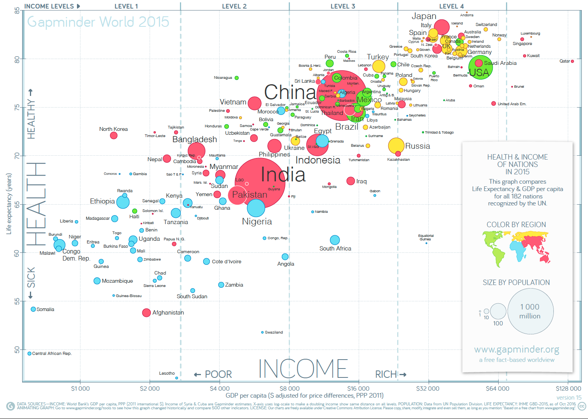

# L1. 課程簡介

## 統計學課程主軸

* 本課程以**實作**為導向，討論的案例都是實際問題。
* 我們會教⼀一個功能強⼤大的軟體R，老師示範講解R的指

  令後，同學都需要實際練習⼀遍。

* 期中考之前，上課請帶筆電，但**老師說打開練習時**方可打開電腦；同學們可共⽤用筆電，或系辦亦有筆電可借。
* 若同學能精通R語⾔的指令與應用，職場上將會有強⼤競爭⼒。
* 事實上，有些國家已將學習寫程式納入中⼩學課綱，當成是國⺠的基本能⼒。


競爭⼒ = 發現問題 + 分析資訊 + 解決方案 + 溝通執⾏。



 若有任何問題。歡迎隨時聯繫國晉助教\(willhongwh@gmail.com\)，或高老師\(kao@cycu.edu.tw\)，謝謝！


## 簽到規定

* 每次上課都需要簽到，可簽到時間⾄至**中午12點**為⽌。
* 老師會依當天簽到表隨機提問。若簽到但點名未到則視為**代簽**，其學期**出席分數將歸零**。
* 所以，在本堂課中誠實是最佳應對。
* 若臨時有事需離開，請記得跟老師說，老師就不會提問題給該位同學。
* 老師希望每位同學在未來都有職場競爭力，所以要求同學每⼀堂課都要積極參與。
* 老師會一直問題，確保每一個人都跟上進度。
* 必要時，同學必須上台操作或解釋指令之用意。

## 個人作業

* 每單元有個⼈人作業，作業需轉成PDF檔並上傳⾄至i-learning。
* 實作是本堂課的核⼼精神，所以作業內容每個人都要實際操作過。
* 我們⿎鼓勵同學間互相討論，期中與期末會請每位同學票選出二位熱⼼助⼈的⼩小老師。
* 每次票選得票數前⼆二⾼高⼩小老師，將公開表揚其優良事蹟，其學期分數依排序各加2分與1分。
* 我們會隨機地在第⼀節課舉行⼩考，問題來自該週繳交作業相關內容，目的是確保大家都有實際做過作業且充分理理解。

## 分組報告與實習課

* 同學須分組進⾏行行學期報告，每一組⼈人數為4⼈。請⼤大家各⾃找好組員，下⼀次上課時將確定分組名單，若找不到組員者老師會幫忙配對。
* 實習課時，各組須依進度製作簡報並上傳⾄至i-learning，助教會跟各組

  討論進度並給予建議。助教亦會點名並對各組表現加以評分。

* 實習課之時間與地點，助教將公佈在i-learning。
* 實習課進度如下：

|  | **進度內容** |  | **進度內容** |
| :---: | :---: | :---: | :---: |
| _第一次實習課_ | **國家選定** | _第四次實習課_ | **繪圖呈現** |
| _第二次實習課_ | **數據蒐集** | _第五次實習課_ | **報告初稿** |
| _第三次實習課_ | **期中考試** | _第六次實習課_ | **期末小考** |

## 學期報告主題

* 每一組從OECD選一個國家，並從首長的角度行銷你的國家，目標是增加移入⼈口數，台下聽眾\(同學\)都是潛在移民者。
* OECD成員國請參⾒：[https://en.wikipedia.org/wiki/OECD](https://en.wikipedia.org/wiki/OECD)。
* 報告請以數據為主軸並將資料視覺化，介紹的重點舉例如下：

1. 該國基本概況\(土地、面積、⼈口等\)
2. 產業概況為何\(產業比例例或失業率等\)
3. 教育、醫療與環境概況
4. 該國之藝術、化與歷史特⾊
5. 該國發展策略與其他關鍵吸引⼒

* 學期報告為循序漸進之過程。最後正式報告於課堂舉行，同學必須給每

  組建議並評分。評分標準依 \(1\)資料呈現 \(2\)專業解說，各給1-5級分。

## 學期報告歷程

* **第一次實習課**：各組針對選定之國家進行簡介，數據的呈現在此階段可以引⽤網路資訊。重點在於透過國家間的比較，凸顯該國特色。
* **第二次實習課**：搜集⽬標國與比較群之相關數據，並註明來源與用意。
* **第四次實習課**：⽤R繪出相關統計圖，重點為清楚、專業與美感展現。
* **第五次實習課**：將所有素材\(數據、圖形與照片\)整理成報告初稿。
* **期末課堂報告**：認真地多次演練並加入壓箱寶，最後呈現完美報告。
* 每組每次實習課需準備5分鐘報告，⽽期末課堂報告時間為8分鐘，所有報告\(四次實習課與期末報告\)皆須上傳⾄i-learning討論區。
* 報告分數依助教評分、同學評分與i-learning上傳檔案為準。
  * 若有組員不參與報告討論，其他組員請一起來跟老師說明狀況，而最後期末報告上傳檔案可將不參與討論者除名。所以⼤家務必要團隊合作並認真準備！

## [Gapminder Tools](https://www.gapminder.org/tools/)

Resource: [https://www.gapminder.org/tools/](https://www.gapminder.org/tools/)

## 競爭⼒ = 發現問題 + 分析資訊 + 解決方案 + 溝通執⾏

