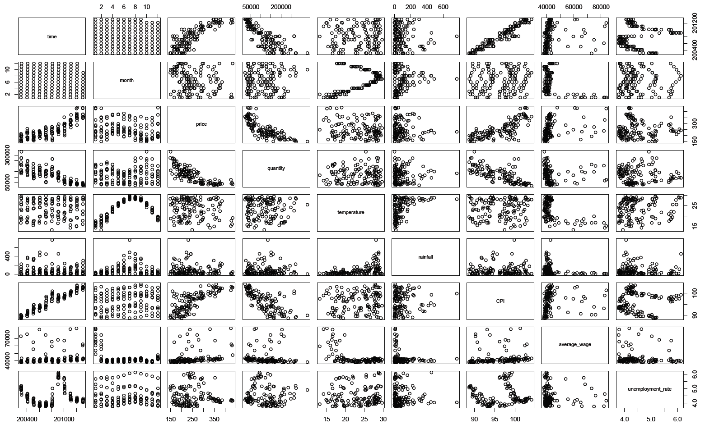
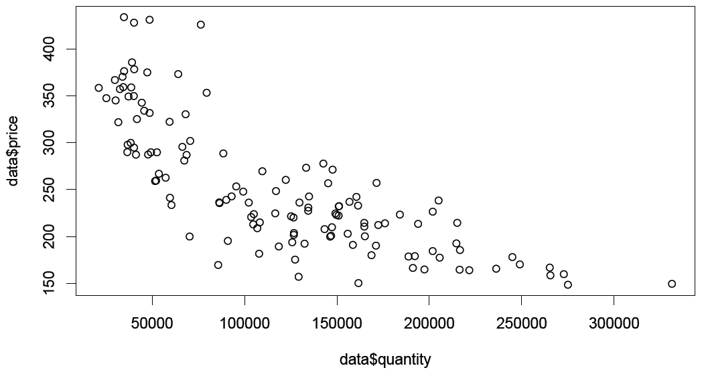
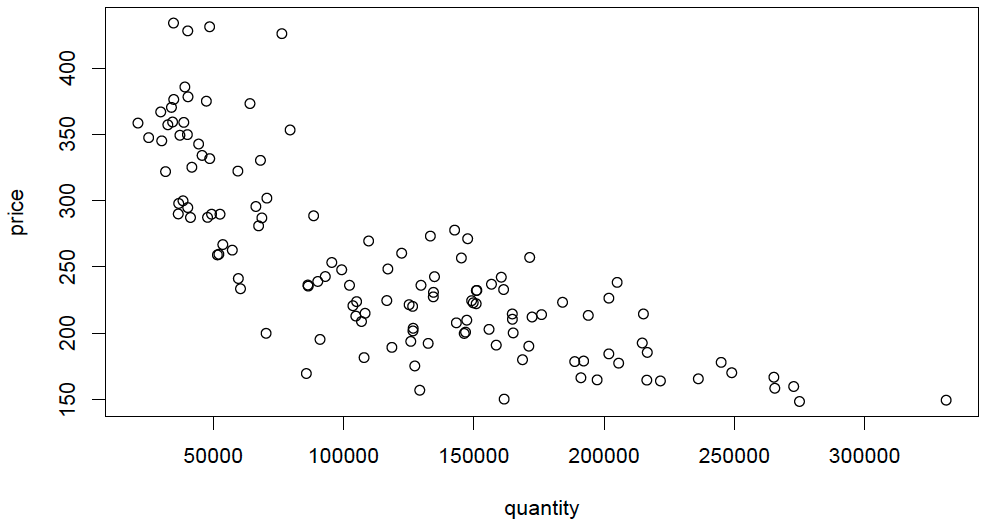

# L2. About R

## 今天介紹

* [ ] 為何學Ｒ
* [ ] Ｒ的安裝
* [ ] 讀入數據
* [ ] 指令討論
* [ ] 練習作業
* 為何學Ｒ
* Ｒ的安裝
* 讀入數據
* 指令討論
* 練習作業

## Why Ｒ？

* 市面上已有方便的套裝軟體如Sxxx與Exxx，還有運算能力強大的Mxxx。為何這堂課要介紹Ｒ?
* Ｒ的最大好處是免費公開，隨時有來自全球各地的聰明人去維護與發展Ｒ，這道理跟Wikipedia線上百科一樣。
* 這特性也代表著，一些最新的分析方法，較可能在Ｒ找到；反之，Sxxx或Exxx會落後一段時間才納入新方法。
* Ｒ簡單易學，十分彈性，大家都能用來寫作業、報告、或論文。
* 老師念博士班時三十多歲才接觸Ｒ，以前沒有修過任何程式相關課程。

## 安裝Ｒ

* Google "R"；連上網頁“The Ｒ Project for Statistical Computing”
  * 網址：[http://www.r-project.org/](http://www.r-project.org/)
* R 畫面左邊找到Download
  * CRAN點下去，找到Taiwan或鄰近國家下載點
  * 選擇你電腦的作業系統
  * 選base
  * 點選最新版本
  * 下載完成後，開始安裝
* 安裝完畢，在應用程式中出現Ｒ!

## Ｒ指令

* 我們將以簡單例子介紹常用的基本指令。同學安裝Ｒ之後，必須練習將這些簡單例子輸入一遍，並呼叫結果加以檢視。
  * 我們會輔以 `底色` 來呈現指令，以利區別正文。
  * `#` 之後的文字是說明用，方便自己與他人理解指令目的，Ｒ不會執行這些說明文字。
* 這些指令不用刻意去背，常用的自然就會記住，不常用的需要時再查即可
* 常用的Reference Card已放在i-learning上，短短幾頁已可應付同學在資料處理上的大部分需求。
* 若不理解Reference Card的說明，網路上可查到指令的中英文相關範例。



## 四則運算

* 將Ｒ打開後，游標閃爍，它在等你下指令。
* 最簡單的指令為四則運算，例如，輸入以下加減法指令：
  * `3+1-2`
  * \# Ｒ會在下一行回答2，而此行開頭 \[1\] 表示2為該串數列的第一個數值\(此例中也是唯一的數值\)，後續例子一串數列可包含許多數值：
* 乘除法之指令：
  * `(2*3)/2`
  * \# 此指令代表 $$2*3 \over 2$$ ，Ｒ會回答3。
  * 2的3次方之指令為 `2^3` 。


試看看，如何計算 $$\sqrt{2^3}$$？


## 建立物件

* Ｒ為物件導向程式語言，用小於符號 `<` 加上減號 `-` 來構成箭頭 `<-` 以指定或定義物件。例如：
  * `a <- 3` \# 定義 $$a = 3$$ 
  * `b <- 2` \# 定義 $$b=2$$
  * `c <- a+b` \# 定義 $$c=a+b$$ 
  * `c` \# 呼叫 $$c = 3+2=5$$ 
* 我們亦可定義物件為一串數列，例如：
  * `x<- 1:5` \# 定義$$x$$ 數列為1到5之整數
  * `y<- c(1,3,1,2,2)` \# 定義 $$y$$ 為一不規則數列
  * `x+y` \# 呼叫 $$x$$ 與 $$y$$ 平行相加的結果


試看看並解釋下列指令作用：

`z<- rep(2,1000)`

`2*z+1`


## Windows：讀入Excel數據

* Ｒ能夠讀取Excel的csv檔，通常原始資料可能是xlsx檔。
* 我們只需要另存新檔，在檔案類型\(T\)中選擇csv逗號分隔即可轉成csv檔。
* 請每位同學建立一個data資料夾，練習將fish.xlsx轉成fish.csv並存在data資料夾中。
* 打開Ｒ，然後用下列指令讀入白鯧魚資料並加以檢視：
  * `data<- read.csv("D://data/fish.csv")`

    \# 將fish.csv讀入Ｒ並命名為data

    \# 此例將fish.csv檔案放在D槽的data資料夾中

    `data` \# 將輸入的data叫出來看是否正確

    `summary(data)` \# 檢視基本統計量







## Mac：讀入數據

* Mac可直接讀取csv檔，指令如下：

  `data<- read.csv("/Users/yicheng/Desktop/fish.csv")`

  \# 此例將fish.csv檔案放在桌面上

  \# 請注意`yicheng` 是老師的Mac筆電名稱，請你改成自己的筆電名稱

* Mac讀取csv檔的另一種簡單方法：

  `data<- read.csv(file.choose())`

  \# Mac會跳出視窗，請點選fish.csv檔案

## 出現中文亂碼

* Mac讀取中文資料有時會出現亂碼，下列指令可解決問題：

  `data<- read.csv(file.choose(),fileEncoding='big5')`

  \# Mac預設的編碼為萬國碼utf

  \# 若在讀取資料指令中加上 `fileEncoding='big5'`  ，Mac將以big5編碼開啟

* 另外，境外同學若用Windows系統讀取中文出現亂碼，亦可用類似方法解決：
* `data<- read.csv("D://fish.csv",fileEncoding='big5')`
* 另一個方法，是直接將fish.csv之檔案存成big5編碼。

## 讀入txt格式數據

* Ｒ可讀取簡單文字檔案txt檔，而變數欄位是用空格、逗號、或冒號分隔，許多大型資料以此格式儲存。
* Windows讀入txt檔之指令：

  `data<- read.table("D://data/fish.txt",head=T)`

  \# 若資料之首列為變數名稱，路徑後須加註`head=T`

  \# 試看看，若不加註`head=T`的結果為何？

* 讀入txt檔通常需要在路徑之後加註 `head=T` ，因其內定值為`head=F`；但讀csv檔則不用，因其內定值為`head=T`。
* 同理，Mac讀入txt檔指令如下：

  `data<- read.table(file.choose(),head=T)`

* 若變數欄位使用冒號區隔，則在路徑後加註`sep=";"` 。

## 用plot畫出數據

`plot(data)` \# 用散佈圖檢視全部資料

## 用$帶出個別資料並畫出數據

`plot(data$quantity,data$price)` \# 用散佈圖檢視價量關係

## 建議先attach再畫出數據

* 建議大家先對資料下`attach`指令，就可直接呼叫各個變數：

  `attach(data)` \# attach資料

  `plot(quantity,price)` \# 用散佈圖檢視價量關係

## 指令練習

* 下載 Reference Card 並與同學討論下列指令：
  * `plot(price,quantity)`
  * `hist(temperature)`
  * `names(temperature)<- time`
  * `boxplot(data)`
  * `boxplot(data[,5:7])`
  * `boxplot(data[,c(4,8)])`
  * `data[1:10,]`
  * `data[2:15,2:5]`
  * `data[2,3]`



## 複習一下

* Ｒ的優點為何?
* Ｒ讀入Excel的指令為何?
* plot指令可畫出何種圖?
* read.table是要讀取哪種格式資料?
* attach指令目的為何?

## 練習作業

* 將fish資料讀入R並命名為data。請將R Reference Card中的Slicing and extracting data範圍內之Indexing vectors與Indexing matrices所有指令操作一遍，並將指令與說明\(\# 用自己的文字說明\) 存成PDF檔。
* 寫上姓名及學號，於下次上課前上傳至i-learning討論區繳交。請控制在2頁內，故只須說明指令意義，呼叫結果不用繳交。例如：
  * `data<- read.csv("D://data/fish.csv")`
  * `attach(data)`
  * `names(price)<- time`
  * `price[2]` \# 白鯧魚價格資料的第二筆數字
  * `price[price %in% c(150.4,214.6)]`
  * \# 白鯧魚價格為150.4以及214.6的月份

## 相信自己可以飛起來🙌

