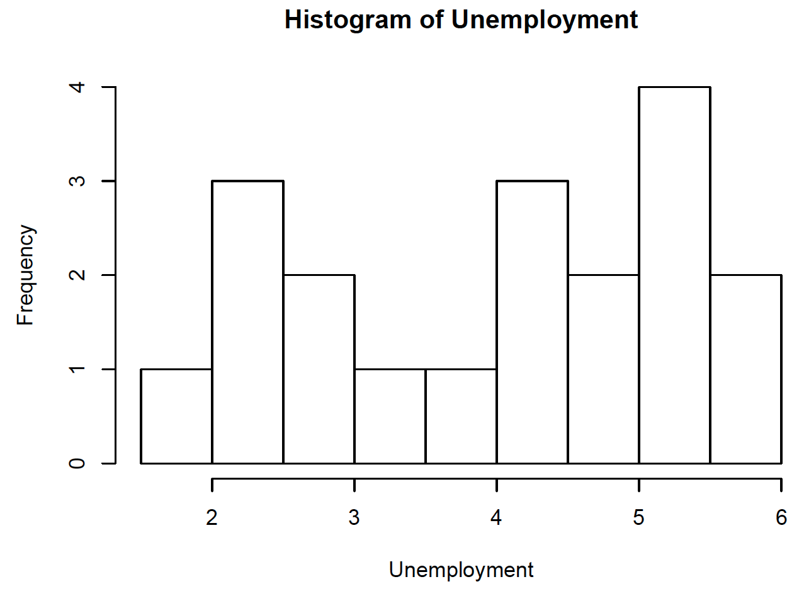
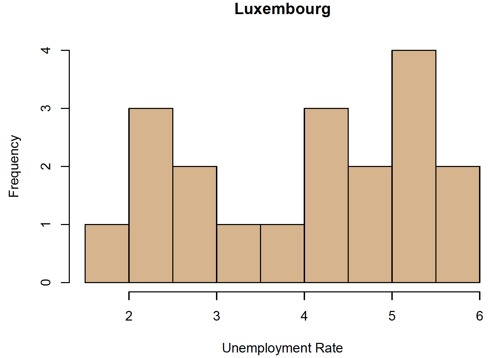

# L3. Graphs

## 今天介紹

* 繪圖指令
* Lattice套件
* 擴充套件
* 圖形後製
* 練習作業

## 繪圖原則

* 一張圖可傳達許多訊息，但訊息不宜太過混雜。
* 要先確定每張圖有那些基本訊息想要傳達給聽眾。
* 接著，思考如下:
  * 選取適合的圖形表達\(box plot, bar chart, time series,…\)
  * 判斷資料間是否需要比較才有意義
  * 資料本身為主角，請去除不需要的說明或裝飾
  * 資料呈現的色彩或形態也可提供相關訊息
  * 資料繪圖沒有一定規則，透過大量實作能逐漸掌握基本原則。
* 同學若能專業地展現於每一次機會，終將成為客戶與老闆信賴的焦點。


精準＋美感＋反覆嘗試＝專業力


## 你亦可展現如此專業


## 讀取資料

* 輸入Luxembourg的總體資料，然後開始練習繪圖相關指令；i-learning 上有csv與txt檔，請選取其中一種資料格式讀取。
* For Windows:

  `lux <- read.csv("d://data/Luxembourg.csv")`

  \# 將csv檔讀進Ｒ並命名為lux

  `lux <- read.table("d://data/Luxembourg.txt",head=T)`

  \# 或用此指令讀取txt檔

* For Mac:

  `lux <- read.csv(file.choose())`

  \# Mac會跳出視窗，請點選Luxembourg.csv檔案

  `lux <- read.table(file.choose(),head=T)`

  \# 或用此指令讀取txt檔






## 基本histogram

`attach(lux)` \# 讓Ｒ可直接呼叫各個column變數

`head(lux)` \# 檢視有哪些變數，但只呈現前面6筆資料

`hist(Unemployment)` \# 畫出該國歷年失業率的histogram



## 修飾histogram\(每一行指令都是一張圖\)

`hist(Unemployment,main="Luxembourg")` \# 加上標題

`hist(Unemployment,main="Luxembourg",xlab="Unemployment Rate")`

\# 再加上x軸示

`hist(Unemployment,main="Luxembourg",xlab="Unemployment Rate", col="tan")`

\# 再加tan色；更多顏色選擇請輸入colors\(\) 詢問Ｒ



## 將histograms放在一起比較

```text
par(mfrow=c(1,3))
# 將以下3張histograms以13 的方式排列於同一張圖
hist(Unemployment,main="Luxembourg")

hist(Unemployment,main="Luxembourg",xlab="Unemployment Rate")

hist(Unemployment,main="Luxembourg",xlab="Unemployment Rate",
col="tan")
```


