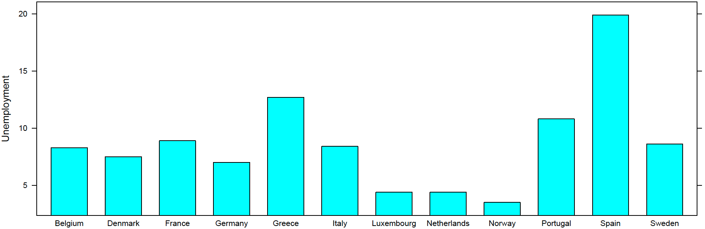

# L3. Graphs

## 今天介紹

* 繪圖指令
* Lattice套件
* 擴充套件
* 圖形後製
* 練習作業

## 繪圖原則

* 一張圖可傳達許多訊息，但訊息不宜太過混雜。
* 要先確定每張圖有那些基本訊息想要傳達給聽眾。
* 接著，思考如下:
  * 選取適合的圖形表達\(box plot, bar chart, time series,…\)
  * 判斷資料間是否需要比較才有意義
  * 資料本身為主角，請去除不需要的說明或裝飾
  * 資料呈現的色彩或形態也可提供相關訊息
  * 資料繪圖沒有一定規則，透過大量實作能逐漸掌握基本原則。
* 同學若能專業地展現於每一次機會，終將成為客戶與老闆信賴的焦點。


精準＋美感＋反覆嘗試＝專業力


## 你亦可展現如此專業


## 讀取資料

* 輸入Luxembourg的總體資料，然後開始練習繪圖相關指令；i-learning 上有csv與txt檔，請選取其中一種資料格式讀取。
* For Windows:

  `lux <- read.csv("d://data/Luxembourg.csv")`

  \# 將csv檔讀進Ｒ並命名為lux

  `lux <- read.table("d://data/Luxembourg.txt",head=T)`

  \# 或用此指令讀取txt檔

* For Mac:

  `lux <- read.csv(file.choose())`

  \# Mac會跳出視窗，請點選Luxembourg.csv檔案

  `lux <- read.table(file.choose(),head=T)`

  \# 或用此指令讀取txt檔






## 基本histogram

`attach(lux)` \# 讓Ｒ可直接呼叫各個column變數

`head(lux)` \# 檢視有哪些變數，但只呈現前面6筆資料

`hist(Unemployment)` \# 畫出該國歷年失業率的histogram


## 修飾histogram\(每一行指令都是一張圖\)

`hist(Unemployment,main="Luxembourg")` \# 加上標題

`hist(Unemployment,main="Luxembourg",xlab="Unemployment Rate")`\# 再加上x軸示

`hist(Unemployment,main="Luxembourg",xlab="Unemployment Rate", col="tan")`

\# 再加tan色；更多顏色選擇請輸入colors\(\) 詢問Ｒ




## 將histograms放在一起比較

`par(mfrow=c(1,3))`

\# 將以下3張histograms以13 的方式排列於同一張圖

`hist(Unemployment,main="Luxembourg")`

`hist(Unemployment,main="Luxembourg",xlab="Unemployment Rate")`

`hist(Unemployment,main="Luxembourg",xlab="Unemployment Rate", col="tan")`

```r
par(mfrow=c(1,3))
# 將以下3張histograms以13 的方式排列於同一張圖
hist(Unemployment,main="Luxembourg")

hist(Unemployment,main="Luxembourg",xlab="Unemployment Rate")

hist(Unemployment,main="Luxembourg",xlab="Unemployment Rate",
col="tan")
```


## 時間序列圖\(Time Series Graphs\)

`par(mfrow=c(1,3))`

\# 將以下3張histograms以13 的方式排列於同一張圖

`plot(Year,Unemployment)`

\# 畫出x軸為年y軸為失業率的各年度資料點

`plot(Year,Unemployment,type="l")`

\# 各年度資料點以line的形式相連

`plot(Year,Unemployment,type="b",col="red2",main="Luxembourg")`

\# 加標示與顏色


## 時間序列之比較

`plot(Year,Temporary_worker,type="l",col="red",main="Luxembourg", ylab="Percentage")` \# 以本張圖為基礎

`lines(Year,Unemployment,lty=2,col="blue")`

\# 再加一條失業率線並用藍色虛線\(lty=2\) 標示

`legend("topleft",c("Temporary","Unemployment"),lty=c(1,2), col=c("red","blue"),bty="n")`

\# 於左上方加上說明圖示，Temporary與Unemployment分別是紅色實線與藍色虛線，bty="n" 為圖示不加外框


## 創意調色

`par(bg="lavender",cex=1.2,lwd=3.5)`

\# par控制下列圖形參數，bg為底色，cex為字型相對大小，lwd為線條寬度

`plot(Year,Temporary_worker,type="l",col="red3",main="Luxembourg",ylab="Percentage",ylim=c(1,9))`

\# ylim=c\(1,9\) 為控制y軸範圍在1至9

`lines(Year,Unemployment,lty=3,col="slateblue4")`

\# 再加一條失業率線並用藍色虛線\(lty=3\) 標示

`legend("topleft",c("Temporary","Unemployment"),lty=c(1,3),col=c("red3","slateblue4"),bty="n")`

\# 於左上方加上說明圖示，Temporary與Unemployment分別是紅色實線與藍色虛線，bty="n" 為圖示不加外框


## 繪圖套件：Lattice

* Lattice是一個專業的繪圖套件。
* 通常Ｒ已安裝Lattice，但使用時須再載入。
* 若無安裝此套件，則點選程序如下：
  * 程式套件: 安裝程式套件:Taiwan: lattice


## 讀取countries資料

* 在練習Lattice的過程中，請先輸入歐洲各國總體資料。
* i-learning 上有csv與txt檔，請選取其中一種資料格式讀取。

**For Windows:**

`eu <- read.csv("d://data/countries.csv")`

\# 將csv檔讀進Ｒ並命名為data

`eu <- read.table("d://data/countries.txt",head=T)`

\# 或用此指令讀取txt檔

**For Mac:**

`eu <- read.csv(file.choose())`

\# Mac會跳出視窗，請點選countries.csv檔案

`eu <- read.table(file.choose(),head=T)`

\# 或用此指令讀取txt檔





## 用Lattice畫barchart

`library("lattice")`

\# 因為Lattice不是Ｒ的內建套件，所以每次打開Ｒ時要載入才能使用

`data10<- subset(eu,Year=="2010")`

\# 呼叫2010年各國資料之子集合\(subset\)，並命名為data10

`attach(data10)`

`barchart(Unemployment~Country)`

\# 畫出各國失業率之barchart，~ 之前為y軸資料，~ 之後為x軸資料



## 反轉資料的barchart

`barchart(Country~Unemployment)`

\# 將資料反轉，~ 之前為y軸資料，~ 之後為x軸資料


## 將barchart資料排序

`barchart(Unemployment~reorder(Country,Unemployment))`

\# 將各國資料依失業率高低重新排序\(reorder\) 後畫出


## 將barchart資料排序並反轉

barchart\(reorder\(Country,Unemployment\)~Unemployment\)

\# 將資料重新排序並反轉畫出


