# L4. Describing Data

## 今天要談


4.1 單變數資料

4.2 雙變數資料

4.3 Programming

4.4 實例分析


## 4.1 單變數資料

#### 大學生起床時間

* 蒐集兩班同學每人起床時間的資料，輸入R並分別命名為data1與data2，然後畫出兩班的資料分佈圖histogram。

`data1<-read.csv("D://data/甲班小考紀錄.csv")` 

`data2<-read.csv("D://data/乙班小考紀錄.csv")` \#不同物件可存入不同資料 

`Wake_Time_A<-data1$起床時間` \#這裡不用attach因為原始資料中兩班變數名稱相同 

`Wake_Time_C<-data2$起床時間` 

`par(mfrow=c(1,2))` 

`hist(Wake_Time_A,col="tan",xlab="Wake Up Time", xlim=c(5,12))` 

`hist(Wake_Time_C,col="tan",xlab="Wake Up Time", xlim=c(5,12))` 

\#上述xlim是用來控制x軸的呈現範圍，我們將兩圖設成相同的xlim以方便比較 









### 4.1.1 兩班起床時間有差異嗎？

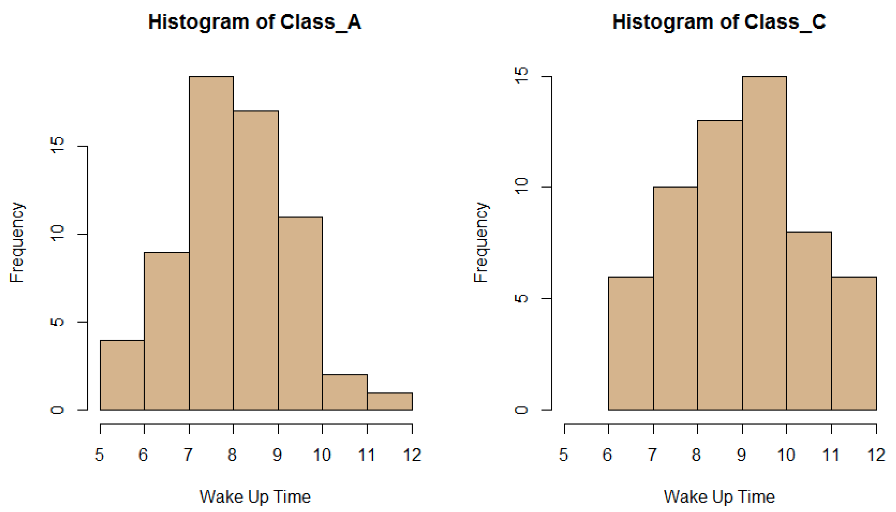

* 看起來好像A班比較早起，但能否有進一步的精確描述呢？

### 4.1.2 平均值

* 當資料為量化變數\(quantitative variable\)時，我們可以計算其平均值\(average\)，用來衡量資料中心點\(重心\)。


若有一串數列 $$x_1, x_2, ..., x_N$$，其平均值（一般簡單寫成$$\bar{x}$$）為數列相加後除以數列個數，亦即：

### $$\bar{x} = {\frac{1}{N}}\sum_{i=1}^N x_i={({X_1+X_2+...+X_N}) \over {N}}$$ 



* 在R語言裡，計算平均值的指令為`mean()`。

`mean(Wake_Time_A)` 

`mean(Wake_Time_C)` \#哪一班平均起床時間較早呢？   



#### 平均值易受極端值影響


* 當資料中出現極端值時，平均值容易受影響而明顯改變位置。 
  * `sample_A <- sample(Wake_Time_A,5)` \#從A班隨機選取5人，並命名為sample\_A 
  * `sample_C <- sample(Wake_Time_C,5)` \#從C班隨機選取5人，並命名為sample\_C 
  * `sample_A` \#呼叫sample\_A，老師此次抽取結果為 $$9,8,6, 8,10$$  
  * `sample_C` \#呼叫sample\_C，老師此次抽取結果為 $$9,9,10,8,10.5$$
  * `mean(sample_A)` \#平均值為 $$8.2$$ ；注意，同學們抽樣的結果會有差異，故平均值亦會不同 
  * `mean(sample_C)` \#平均值為 $$9.3$$
  * `sample_A[5] <- 22` \#若TA不小心將sample\_A第五位的早上10點紀錄成晚上10點 
  * `mean(sample_A)` \#sample\_A的平均值將會**從** _****_$${\color{OrangeRed}{8.2}}$$ **大幅增加為** $${\color{OrangeRed}{10.6}}$$  
* 實務上，出現極端值不一定是紀錄誤差；例如，某地區家戶所得資料包含Bill Gates，就會大幅拉高該區平均所得。  

### 4.1.3 標準差

* 當資料為量化變數時，我們可以計算其標準差\(standard deviation\)，用以衡量資料的離散程度。


數列 $$X_1, X_2, ... , X_N$$，其標準差（寫成 $$s$$，而 $$s^2$$ 稱變異數variance）為各數字與平均值相減後除以（數列個數-1）再開根號，亦即：

標準差 $$=\sqrt{\frac{\sum_{i=1}^N (X_i-\bar{X})^2}{N-1}} \   = \sqrt{({X_1-\bar{X})^2+ (X_2 - \bar{X})^2 +...+(X_N-\bar{X}})^2 \over {N-1}}$$ 


* 在R語言裡，計算標準差的指令為 `sd()`。
  * `sd(Wake_Time_A)` 
  * `sd(Wake_Time_C)` \#哪一班平均起床時間的標準差較大呢？ 

### 4.1.4 中位數

* 假設 $$X_1, X_2, ..., X_5 = 1,2,3,4,5$$ ，計算其平均值為 $$\bar{X}=3$$ 。
* 假設 $$Y_1, Y_2, ..., Y_5 = 36,2,3,4,5$$ ，計算其平均值為：

   $$\bar{Y}={{(36+2+3+4+5)} \over {5}}=10$$ 

顯然地， $$Y$$ 數列的第一筆資料拉高平均值。

* 若我們將上述兩數列由小排到大，位於中間位置的數字即為中位數\(median\)。 $$X$$ 與 $$Y$$ 數列的中位數分別為$$3$$ 與$$4$$ ，故中位數較不受極端值影響。 
* 若要將排序後的 $$X_1,X_2,X_3,X_4,X_5,X_6,X_7,$$ 切成四等份，則需要切三刀，分別稱為 $$Q_1=X_2, Q_2=X_4$$ 、\(亦即中位數\)、以及 $$Q_3=X_6$$ 。 
* 在R語言裡，計算中位數的指令就是 `median ()`。 
* 不過，我們可以直接對某數列下 `summary()` 指令，R就會回報該數列的最小值、 $$Q_1$$ 、中位數、 $$Q_3$$ 、最大值、以及平均值。

`summary(Wake_Time_A)`  
\#以下為輸出結果

| Min. | 1st Qu. | Median | Mean | 3rd Qu. | Max. |
| :---: | :---: | :---: | :---: | :---: | :---: |
| 5.5 | 8.0 | _**8.5**_ | _**8.5**_ | 9.0 | 12.0 |

`summary(Wake_Time_C)`  
\#以下為輸出結果

| Min. | 1st Qu. | Median | Mean | 3rd Qu. | Max. |
| :---: | :---: | :---: | :---: | :---: | :---: |
| 6.000 | 8.000 | _**9.250**_ | _**9.345**_ | 10.000 | 12.000 |


A班確實比較早起，而兩班分佈均相當對稱。



### 4.1.5 Boxplot

另外，我們可以直接對某數列下 `boxplot()`指令，R會繪出該數列的最小值、 $$Q_1$$ 、中位數、 $$Q_3$$ 、最大值，稱為箱型圖\(boxplot\)。 

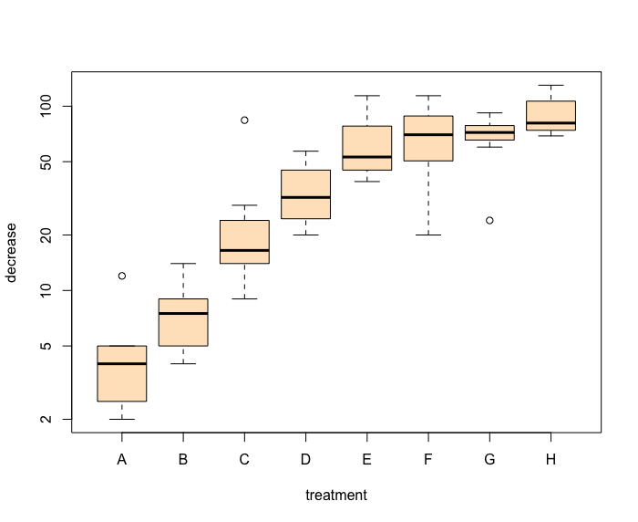

`boxplot(Wake_Time_C)` \#可看出C班數據分佈相當對稱，故其中位數與平均值相近。

## 4.2 雙變數資料


### 4.2.1 關聯性

* 我們經常對於事物與事物之間的關聯性感到興趣，並試著尋求因果關係的解釋。然而，關聯性並不一定代表有因果關係存在。  
* 例，$$X=$$ 打火機數量， $$Y=$$肺癌發生率，雖然資料顯示$$X$$與$$Y$$有顯著的關聯性，但不能直接說$$X$$導致$$Y$$。WHY? 
* 無論如何，先能從資料中看出有趣的關聯性為第一步。 開始囉！

`data1<- read.csv("D://data/甲班小考紀錄.csv")` 

`data2<- read.csv("D://data/乙班小考紀錄.csv")` 

`Wake_Time_A<-data1$起床時間` 

`Wake_Time_C<-data2$起床時間` 

`Bed_A<-data1$睡覺時間` 

`Bed_C<-data2$睡覺時間` 

### 

### 4.2.2 散佈圖

* 我們用散佈圖\(scatterplot\)將睡覺時間放X軸，而起床時間放Y軸，再把兩班同學的資料，以每人為一點的方式繪在圖中。
* 不過，晚上22點要如何跟半夜2點比較，資料需要調整一下。 

`Bed_Time_A <- ifelse(Bed_A<12,Bed_A+24,Bed_A)`  
\#用ifelse指令來調整睡覺時間Bed\_A並新命名為Bed\_Time\_A: 若半夜2點睡\(&lt;12\)，則紀錄為24+2；若晚上22點睡\(&gt;12\)，則紀錄仍為22 

`Bed_Time_C <- ifelse(Bed_C<12,Bed_C+24,Bed_C)` 

`par(mfrow=c(1,2))` 

`plot(Bed_Time_A,Wake_Time_A,col="blue",pch=16)` \#pch=16指實心原點 

`plot(Bed_Time_C,Wake_Time_C,col="blue",pch=16)` \#其它pch請參見Reference Card 

#### 睡覺時間與起床時間之散佈圖

* 從散佈圖看出，似乎睡覺時間較晚的人，其起床時間亦較晚。 
* 進一步的問題是，此正向關聯性有多強，兩班一樣嗎？

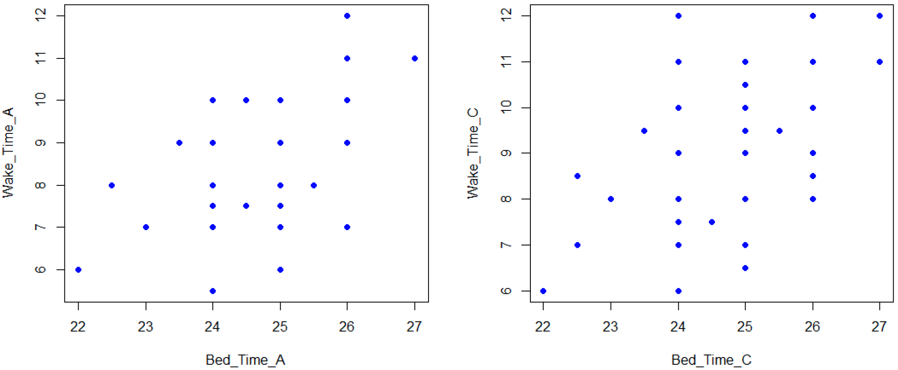

### 4.2.3 相關係數

* $$X$$ 與 $$Y$$為量化變數時，我們可以計算其相關係數\(correlation\)，用以衡量 $$X$$與$$Y$$ 的關聯性程度高低。


若有兩串數列 $$X_1,X_2,...,X_N$$以及 $$Y_1,Y_2,...,Y_5$$ ，其平均值與標準差分別為$$\bar{X}$$ 與 $$\bar{Y}$$ 以及 $$S_X$$ 與$$S_Y$$ ，相關係數為兩數列標準化後之乘積加起來，再除以$$N-1$$ ，亦即:

相關係數 $$={\sum_{i=1}^N  \bigl(\begin{smallmatrix} \frac{\mathrm{X_i-\bar{X}} }{\mathrm{S_X}} \end{smallmatrix}\bigr)   \bigl(\begin{smallmatrix} \frac{\mathrm{Y_i-\bar{Y}} }{\mathrm{S_Y}} \end{smallmatrix}\bigr)  \over N-1}$$ 


* 理論上，相關係數之值介於$$-1$$ 至 $$+1$$ 之間。

### 4.2.4 計算相關係數

* 在R語言裡，計算相關係數的指令為cor\(\)

`cor(Bed_Time_A,Wake_Time_A)`   
\#A班睡覺時間與起床時間的相關係數為0.5125695 

`cor(Bed_Time_C,Wake_Time_C)`   
\#C班睡覺時間與起床時間的相關係數為0.5156468  
 

* 另外，再計算睡覺時間與小考分數的相關係數

`Score_A <-data1$小考分數` 

`Score_C <-data2$小考分數` 

`cor(Bed_Time_A,Score_A)`   
\#A班睡覺時間與小考分數的相關係數為0.03673618 

`cor(Bed_Time_C,Score_C)`  
\#C班睡覺時間與小考分數的相關係數為-0.06096085   


### 4.2.5 睡覺時間與小考分數之散佈圖

`par(mfrow=c(1,2))` 

`plot(Bed_Time_A,Score_A,col="blue",pch=16)` 

`plot(Bed_Time_C,Score_C,col="blue",pch=16)` 

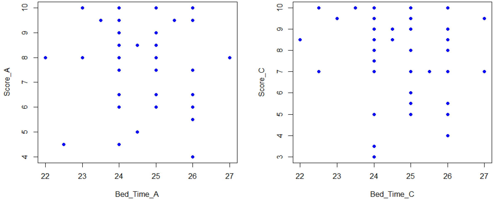

### 

### 4.2.6 不同相關係數之散佈圖

* 理論上，相關係數之值介於$$-1$$ 至 $$+1$$之間。 
* 相關係數$$=1$$時稱完全正相關，而相關係數$$=-1$$時稱完全負相關。 
* 我們將上述四張圖以及兩種極端情況繪在一起比較。 

`par(mfrow=c(2,3))` 

`plot(1:30,1:30,col="blue",pch=16,main="cor= 1")` 

`plot(Bed_Time_A,Wake_Time_A,col="blue",pch=16,main="cor= 0.5258")` 

`plot(Bed_Time_C,Wake_Time_C,col="blue",pch=16,main="cor= 0.5156")` 

`plot(Bed_Time_A,Score_A,col="blue",pch=16,main="cor= 0.008")` 

`plot(Bed_Time_C,Score_C,col="blue",pch=16,main="cor= -0.060")` 

`plot(1:30,2*(30:1),col="blue",pch=16,main="cor= -1")` 

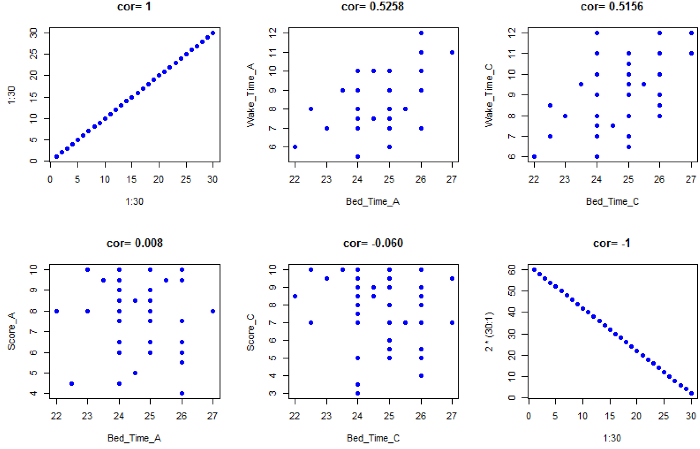

### 

### 4.2.7 探討性別差異

* 若資料中有類別變數\(Categorical Variable，或稱質性變數\)，我們可進一步區分，不同類別的相關係數之差異。 
*  實務上，**性別變數常常是重要的差異來源**。  
* 不過，類別變數非量化變數，無法算平均與標準差，故不能算類別變數與量化變數間的相關係數。 
* 因此，我們**依類別變數加以分群**，再來計算不同群間量化變數的相關係數。 

`data1<- read.csv("D://data/甲班小考紀錄.csv")` 

`m<- subset(data1,性別=="男")`  
\#subset是將data1中性別變數為"男"的資料抽出來，並存為物件m 

`w<- subset(data1,性別=="女")`  
\#同理，將女同學存為物件w   


### 4.2.8 男女同學相關係數的差異

`Wake_Time_M<-m$起床時間` \#定義男同學起床時間，以下類推 

`Wake_Time_W<-w$起床時間`

`Bed_M<-m$睡覺時間` 

`Bed_W<-w$睡覺時間` 

`Bed_Time_M<- ifelse(Bed_M<12,Bed_M+24,Bed_M)`  
\#睡覺時間必須調整，參見前面說明 

`Bed_Time_W<- ifelse(Bed_W<12,Bed_W+24,Bed_W)` 

`cor(Bed_Time_M,Wake_Time_M)`   
\#A班**男同學**睡覺時間與起床時間的相關係數為 $$0.71574 $$ 

`cor(Bed_Time_W,Wake_Time_W)`  
\#A班**女同學**睡覺時間與起床時間的相關係數為 $$0.3357862 $$ 


A班男女同學間睡覺時間與起床時間的相關係數差異頗大。 Why?


> ### 先把資料畫出來看 👩💻📈👨💻

`par(mfrow=c(1,2))` 

`plot(Bed_Time_M,Wake_Time_M,col="blue",pch=16)` 

`plot(Bed_Time_W,Wake_Time_W,col="red",pch=16)` 

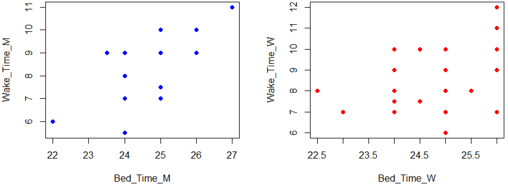

### 

> ### 複習一下：相關係數👉


若有兩串數列 $$X_1, X_2, ..., X_N$$ 以及 $$Y_1, Y_2, ..., Y_N$$ ，其平均值與標準差分別為 $$\bar{X}$$ 與 $$\bar{Y}$$ 以及 $$S_X$$ 與 $$S_Y$$ ，相關係數為兩數列**標準化**後之乘積加起來，再除以 $$N-1$$ ，亦即：

相關係數 $$={\sum_{i=1}^N  \bigl(\begin{smallmatrix} \frac{\mathrm{X_i-\bar{X}} }{\mathrm{S_X}} \end{smallmatrix}\bigr)   \bigl(\begin{smallmatrix} \frac{\mathrm{Y_i-\bar{Y}} }{\mathrm{S_Y}} \end{smallmatrix}\bigr)  \over N-1}$$ 


`(Bed_Time_M-mean(Bed_Time_M))/sd(Bed_Time_M)`  
\#將資料標準化但可用`scale()`替代 

`sBed_Time_M<- scale(Bed_Time_M)`  
\#將男同學睡覺時間數值標準化並稱sBed…，以下類推 

`sWake_Time_M<- scale(Wake_Time_M)` 

`sBed_Time_W<- scale(Bed_Time_W)` 

`sWake_Time_W<- scale(Wake_Time_W)` 


### 4.2.9 再將標準化前後的資料畫出來比較

`par(mfrow=c(2,2))` 

`plot(Bed_Time_M,Wake_Time_M,col="blue",pch=16,main="Original")` 

`plot(Bed_Time_W,Wake_Time_W,col="red",pch=16,main="Original")` 

`plot(sBed_Time_M,sWake_Time_M,col="blue",pch=16,main="Standardized")` 

`abline(v=0,h=0,col="darkgray")`  
\#在第三張圖加入x=0及y=0的兩條灰色直線 

`plot(sBed_Time_W,sWake_Time_W,col="red",pch=16,main="Standardized")` 

`abline(v=0,h=0,col="darkgray")`  
\#在第四張圖加入x=0及y=0的兩條灰色直線 

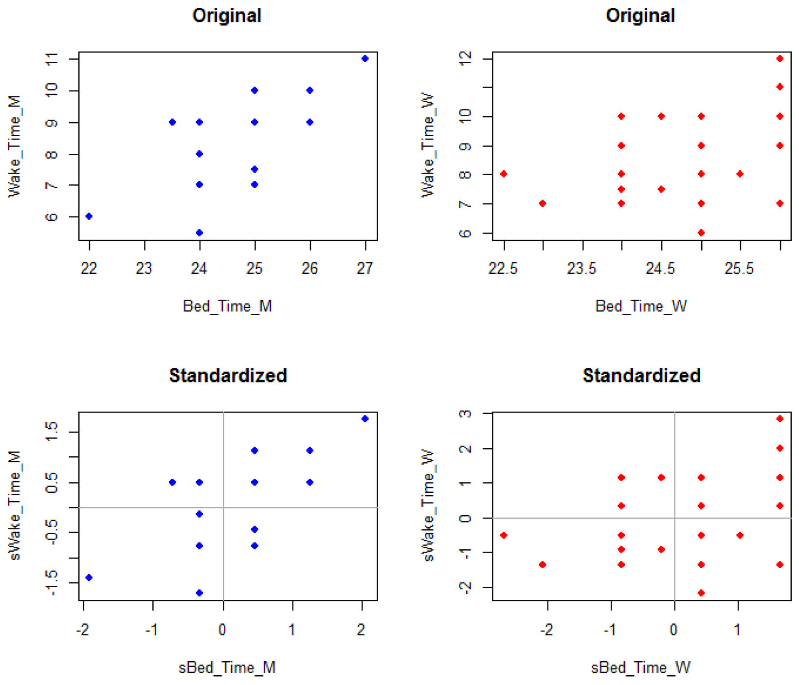

## 4.3 Programming


### 4.3.1 for的程式語法

* R語言有許多程式語法，讓電腦執行重複的動作，可以大幅增加工作效率，我們先介紹 for 的應用。 

`a <-1:6` \#製造1,2,..,6數列 

`b <- rep(1,6)` \#製造重複1的數列且長度為6，換言之，6個1 

`c <- rep(0,6)` \#製造重複0的數列且長度為6，換言之，6個0 

`for (i in 1:6){` 

`c[i]<- b[i]+a[i]` \#請R從i=1開始執行{}內的事情一直到重覆執行到i=6 

`}` 

`c` \#呼叫重新計算後之c，可觀察到原本6個0已依序被2,3,4,5,6,7取代   


### 4.3.2 for 計算移動平均與標準差

* 由{1,2,3,4,5,6}數列中，計算距離為3的移動平均與標準差。

`x<- 1:6` \#創造1,2,…,6數列x 

`m<- 3` \#定義距離為3 

`t<- length(x)` \#計算x的長度\(資料個數\) 

`y<- rep(0,t-m+1)` \#創造0,0,…,0數列y，讓計算後的移動平均數值儲存 

`v<- rep(0,t-m+1)` \#創造0,0,…,0數列v，讓計算後的標準差儲存 

`n<- length(y)` \#計算y的長度\(資料個數\) 

`for (i in 1:n){` 

`y[i] <-mean(x[i:(i+m-1)])` \#計算移動平均並取代y\[i\] 

`v[i] <-sd(x[i:(i+m-1)])` \#計算移動標準差並取代v\[i\] 

`}` \# 上述for的程式語法，R會將i從1數到n並依次代入{ }中加以計算 

`y` \#呼叫移動平均 

`v` \#呼叫移動標準差 

## 4.4 實例分析


### 4.4.1 台積電\(TSMC\)股價的歷史價格資料為例

`data <- read.csv("D://data/TSMC_UMC.csv")` 

`head(data)` 

`attach(data)` 

`plot(日期,台積電收盤價_新台幣元,main="TSMC Stock Price")` 

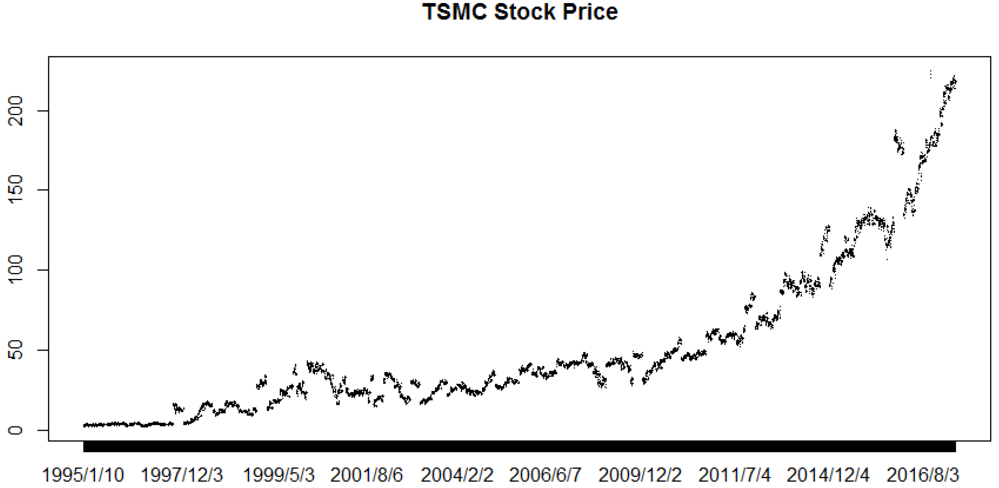









### 4.4.2 TSMC股價的移動平均與標準差圖

```r
x<- 台積電收盤價_新台幣元
m<- 100
t<- length(x)
y<- rep(0,t-m+1)
v<- rep(0,t-m+1)
n<- length(y)
for (i in 1:n){
y[i] <-mean(x[i:(i+m-1)])
v[i] <-sd(x[i:(i+m-1)])
}
par(mfrow=c(2,1))
plot(y,type="l",col="blue",main="TSMC Price MA",ylab="MA of 100 days",xlab="Time")
plot(v,type="l",col="blue",main=" TSMC Price MS",ylab="MS of 100 days ",xlab="Time")
```

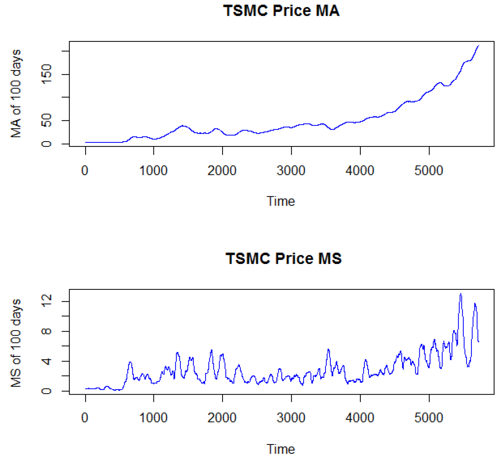


🤔 Ｑ：為何TSMC近期股價波動（標準差）越大？



👇 Try：給定m=60日，繪出近500個交易日移動平均與標準差圖


```r
data<- read.csv("D://data/TSMC_UMC.csv")
attach(data)
d<- length(台積電收盤價_新台幣元)-500
x<- 台積電收盤價_新台幣元[-(1:d)]
m<- 60
t<- length(x)
y<- rep(0,t-m+1)
v<- rep(0,t-m+1)
n<- length(y)
for (i in 1:n){
y[i] <-mean(x[i:(i+m-1)])
v[i] <-sd(x[i:(i+m-1)])
}
par(mfrow=c(2,1))
plot(y,type="l",col="blue",main="TSMC Price Moving Average during the Last 500 Days",ylab=" MA of 60 days",xlab="Time")
plot(v,type="l",col="blue",main=" TSMC Price Moving SD during the Last 500 Days ",ylab=" MS of 60 days ",xlab="Time")
```

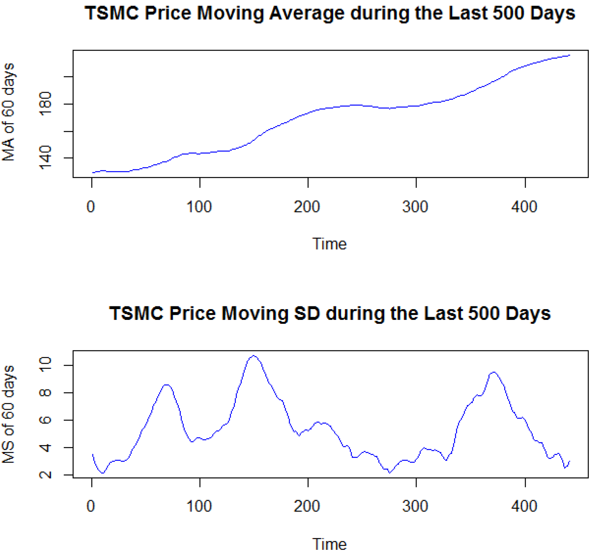

### 4.4.3 TSMC與聯電\(UMC\)股價的移動相關係數

```r
data<- read.csv("D://data/TSMC_UMC.csv") 
attach(data) 
x1<- 台積電收盤價_新台幣元 
x2<- 聯電收盤價_新台幣元 
m<- 100 
t<- length(x1) 
y1<- rep(0,t-m+1) 
y2<- rep(0,t-m+1) 
c<- rep(0,t-m+1) 
n<- length(y1) 
for (i in 1:n){ 
y1[i] <-mean(x1[i:(i+m-1)]) 
y2[i] <-mean(x2[i:(i+m-1)]) 
c[i] <-cor(x1[i:(i+m-1)],x2[i:(i+m-1)]) 
} 
par(mfrow=c(3,1)) 
plot(y1,type="l",col="blue",main="台積電股價移動平均",ylab="100日移動平均值",xlab="時間") 
plot(y2,type="l",col="blue",main="聯電股價移動平均",ylab="100日移動平均值",xlab="時間") 
plot(c,type="l",col="blue",main="台積電與聯電股價相關係數",ylab="100日移動相關係數",xlab="時間") 
abline(h=0,col="darkgray") 
```

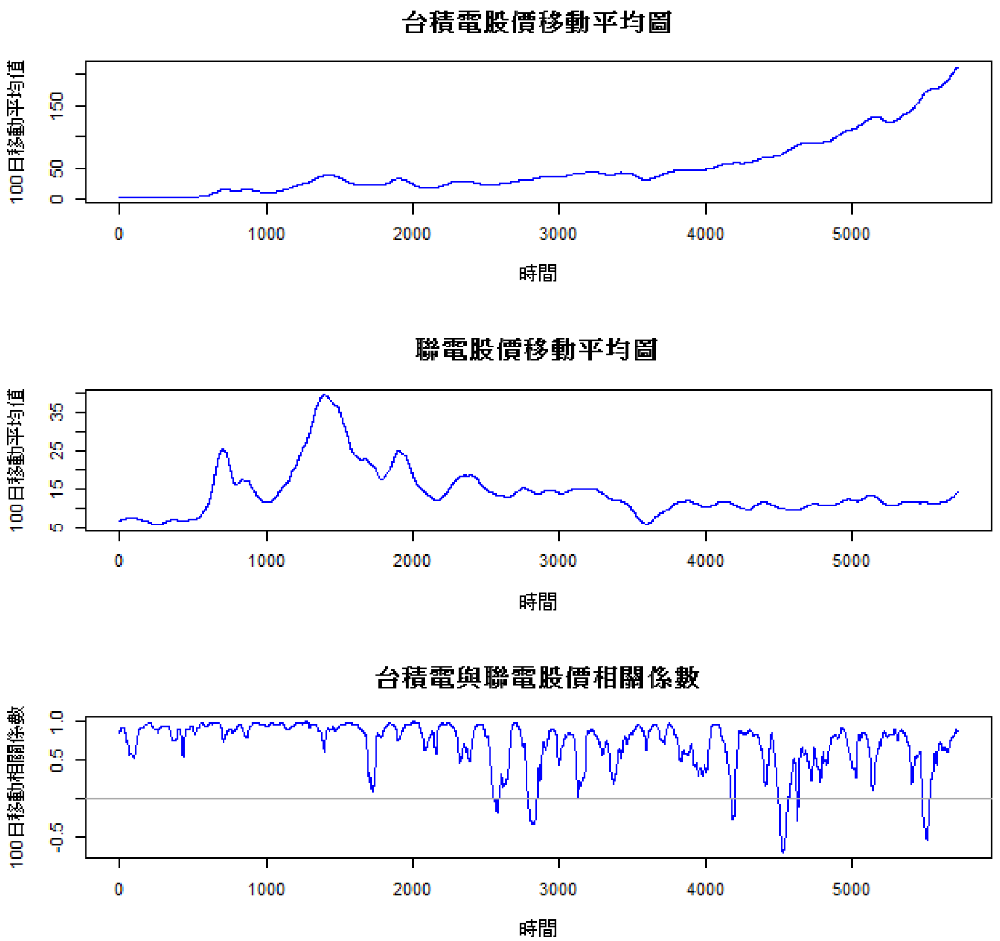


**有沒有問題？**


## 作業

* 給定m=60日，請繪出台積電股價最近500個交易日之**日報酬率**移動平均與
* 標準差圖。 
* 給定m=60日，請繪出台積電與聯電股價最近5000個交易日之**日報酬率**移動相關係數圖。
* 同學必須將其上述結果之**程式碼**附在繳交作業中。 


報酬率算法提示: 

`p<- 1:6` 

`x<- (p[-1]-p[-6])/p[-6]`


## 複習一下

* 何謂標準差？如何算？
* 相關係數理論範圍？如何解釋? 
* for指令作用為何？
* 何謂移動平均值？
* 加油！

