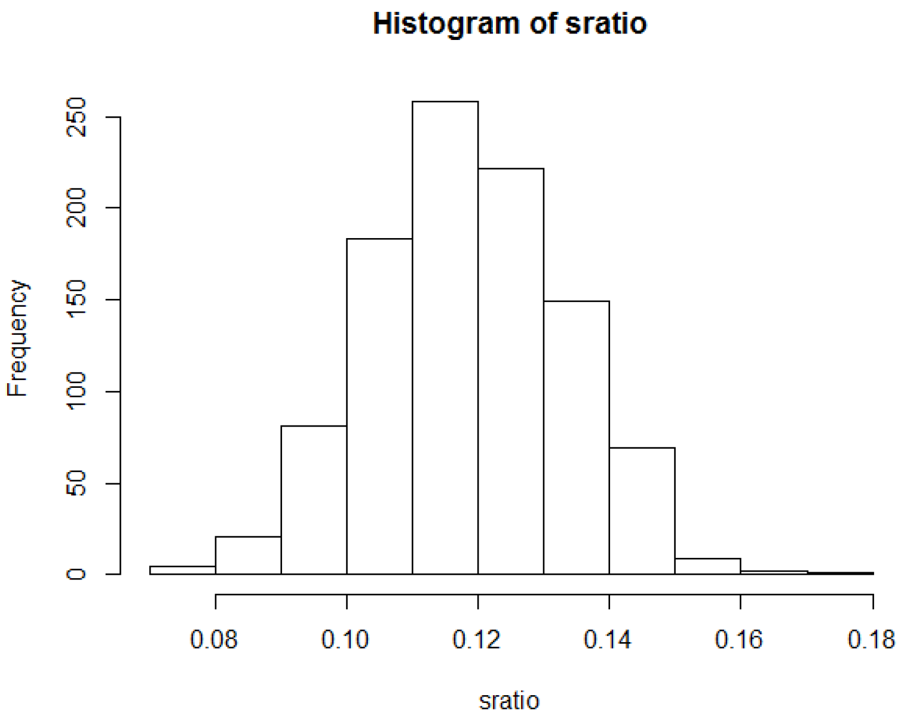
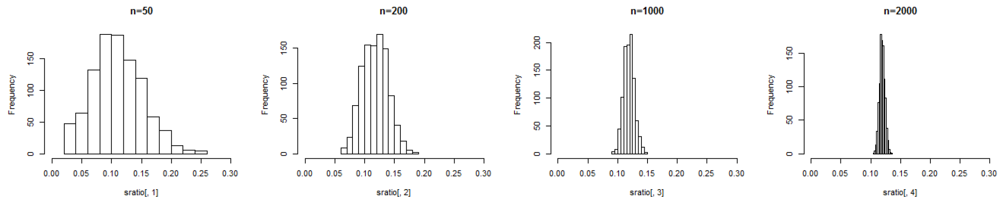

# L6. Sampling Distribution

## 今天要談

* 抽樣調查
* 中央極限定理
* 實例模擬
* 比例抽樣

## 抽樣調查

* 當我們探討對象或**群體數目很大**時，要蒐集全部資料可能很耗時間與金錢成本，此時進行**抽樣調查**是實際上常用的方式。
* 我們要怎樣進行抽樣與解讀抽樣結果？
* 例如，主計處要公布每月失業率，不可能每一次都調查全國**1738萬**的勞動力人口。
* 事實上，全世界國家公佈的每月失業率都是抽樣調查結果。 


* **勞動力**：指15歲以上可以工作之民間人口，包括就業者及失業者。  
* **非勞動力**：指15歲以上不屬於勞動力之民間人口，包括因求學或準備升學、料理家務、高齡、身心障礙、想工作而未找工作及其他原因等，而未工作亦未找工作者。 


## 隨機抽樣實作

* 我們在班上進行下列問卷，並請同學隨機抽樣調查五位同學的答案作為估計樣本。

1. 請問你昨日使用手機講了幾通電話\(打來與撥出皆算\): $$0$$ 
2. 你猜測全班同學平均每人昨日使用手機講了幾通電話: $$1.5$$ 
3. 請隨機詢問班上五位同學的昨日使用手機講了幾通電話，填在下表並計算平均值\(四捨五入計算到小數點第一位\)。 

| 第一位  | 第二位  | 第三位  | 第四位  | 第五位  |
| :---: | :---: | :---: | :---: | :---: |
| $$1$$  | $$0$$  | $$1$$  | $$2$$  | $$1$$  |

* 五位同學平均值: $$1.5$$ 

## 母體與樣本

* 如果我們關心全班的通話次數，那麼研究母體\(population\)就是全班學生。
* 全班通話次數平均值，稱為母體參數\(parameter\)。 
* 每位同學抽樣調查五位同學的答案，即為樣本\(sample\)。 
* 計算樣本中五位同學的通話次數平均值，稱為樣本統計\(sample statistic\)。每位同學調查平均值之分佈，即為抽樣分配。
* 從同學的立場，是用樣本統計去推估母體參數；換言之，就是用樣本平均值去猜測全班通話次數平均值。
* 如果，我們研究全國學生通話次數，何為母體? 何為樣本? 

## 結果分析

`data<- read.csv("D://data/手機通話調查.csv")` 

`attach(data)` 

`mean(call)` \#自己通話次數之母體平均值 

`mean(guess)` \#個人猜測結果之平均值 

`mean(sample_mean)` \#全班抽樣結果之平均值 

`par(mfrow=c(1,3))` 

`hist(call)` 

`hist(guess)` 

`hist(sample_mean)` 

## 去除outliner

`par(mfrow=c(1,3))` 

`hist(call[-62])` \#拿掉第62筆資料 

`hist(guess[-62])` 

`hist(sample_mean[-62])` 

`mean(call[-62])` 

`mean(guess[-62])` 

`mean(sample_mean[-62])`

## 電腦抽樣

* 如果同學抽樣只問坐在附近的人，會影響推論結果嗎? 
* 若有影響，如何避免? 

`sam<- function(x,n){` 

`y<- 1:length(x)` 

`for (i in 1:length(x)){` 

`y[i]<- mean(sample(x,n))` 

`}` 

`y` 

`}` 

\# 我們創造一個`function`叫`sam(x,n)`，等會只要帶入x與n，R就會計算{ }內所有事情 

## 試試樣本數增加的結果

`m<- max(call) #將全班通話次數最高值記為m` 

\# 以下圖形將x軸固定在0-m之範圍以方便比較 

`par(mfrow=c(2,3))` 

`hist(call,xlim=c(0,m))` 

`hist(guess[-62],xlim=c(0,m))` 

`hist(sample_mean,xlim=c(0,m))` 

`hist(sam(call,5),xlim=c(0,m))` 

`hist(sam(call,25),xlim=c(0,m))` 

`hist(sam(call,50),xlim=c(0,m))` 

## 隨機抽樣與樣本增加的效果

## 分開檢視男女同學資料

 `male<- subset(data[-62,],gender=="1")` 

\#將男同學\(gender==1\)資料存成male 

`female<- subset(data[-62,],gender=="0")` 

\#將女同學\(gender==0\)資料存成female ``

`par(mfrow=c(2,3))` 

`hist(male$call,xlim=c(0,m))` 

`hist(male$guess,xlim=c(0,m))` 

`hist(male$sample_mean,xlim=c(0,m))` 

`hist(female$call,xlim=c(0,m))` 

`hist(female$guess,xlim=c(0,m))` 

`hist(female$sample_mean,xlim=c(0,m))` 

## 男女是否有差異?

## 中央極限定理

## 全校各年級成績平均值

* 我們以全校學生的學期成績調查為例。
* 在99學年度下學期，Alpha同學進行「大學生延畢原因與調查」的專題研究時，想要了解全校不同年級學生的平均成績是否有差異，特別是**大五延畢生**的學業成績表現。 
* 他的基本猜測: 大一 &lt; 大二 &lt; 大三 &lt; **大五** &lt; 大四。 Why? 
* 此時，全校12905位大學生為研究的**母體**。 
* 另外，Alpha透過線上問卷調查，得到245位學生的完整回覆資料。 這245位學生則為研究之**樣本**。
* Alpha將利用樣本的訊息去猜測母體的真正數值。 

## 中央極限定理\(Central Limit Theorem\)

* 若Alpha樣本裡有$$n=49$$ 位大五生成績 $$(x_i, i=1,2, ..., n)$$ ，他可以計算樣本平均值 $$\bar{x}_{alpha}=(x_1+x_2+ ...+x_{49})/n$$ 。  
* 假設另外有 $$n$$ 個專題學生 $$\text{Beta}, \text{Gamma}, ...\text{Sigma}$$等都跟$$\text{Alpha}$$ 做一樣的抽樣調查，即有 $$t$$ 筆樣本平均值 $$\begin{matrix} \underbrace{\bar{X}_\text{Alpha}, \bar{X}_\text{Beta},... ,\bar{X}_\text{Sigma}}\\ \text{t averages} \end{matrix}$$ 。 
* 中央極限定理：令母體資料之平均值與標準差為 $$\mu$$ 與 $$\sigma$$ 。 若每次抽樣數目 $$n$$ 夠多，不論母體分配為何，重複抽取 $$t$$ 次之樣本平均值會呈現平均為 $$\mu$$ 而標準差為 $${\frac{\sigma}{\sqrt{n}}}$$ 之常態分配。 

## 實例模擬

## 我們用真實的資料來實驗一遍

* 首先打開R，然後讀入99學年上學期全校成績資料如下：

`data <- read.csv("D://data/991_scores.csv")` 

`summary(data)` \# 檢視資料的基本特徵如何 

`data1 <- subset(data,year=="1")` \#將1年級學生成績存成data1 

`data2 <- subset(data,year=="2")` \#將2年級學生成績存成data2 

`data3 <- subset(data,year=="3")` \#同理類推 

`data4 <- subset(data,year=="4")` \#同理類推 

`data5 <- subset(data,year=="5")` \#同理類推 



## Alpha隨機抽樣結果 

`一年級 <- sample(data1$academic,49)` \#抽49位1年級學生成績 

`二年級 <- sample(data2$academic,49)` \#抽49位2年級學生成績 

`三年級 <- sample(data3$academic,49)` \#同理類推 

`四年級 <- sample(data4$academic,49)` \#同理類推 

`五年級 <- sample(data5$academic,49)` \#同理類推 

`sample <- cbind(一年級,二年級,三年級,四年級,五年級)` \#將抽樣結果合併 

`write.csv(sample,file="D://data/991全校學生成績抽樣.csv",row.names=F)` \# 將抽樣結果以csv格式寫入電腦並存成"991全校學生成績抽樣.csv"之檔案

## Mac讀入Alpha的隨機抽樣結果

* 將抽樣結果合併為sample後，然後用下列指令寫入資料：

`write.csv(sample,file="desktop/全校學生抽樣調查.csv",row.names=F)` 

\# Mac桌面上就會有全校學生抽樣調查之csv檔案出現。

* 另外，如果檔案中的中文出現亂碼，請一開始讀入資料時，即將R編碼設定為big 5如下: 

`data<-read.csv(file.choose(), fileEncoding='big5')` 

\# 這是因為Mac預設的編碼為萬國碼utf，所以加上`,fileEncoding='big5'`，將選擇的檔案用big5編碼開啟。 


以上感謝蔡佳樺、陳冠中、劉正祥同學們提供之解決方案！


## 檢視Alpha的隨機抽樣結果 

`summary(sample)`

* 是否符合其基本猜測: 大一 &lt; 大二 &lt; 大三 &lt; **大五** &lt; 大四 
* 若有 $$n=1000$$ 個專題學生 $$Beta, Gamma, ..., Sigma$$等都跟 ``$$Alpha$$做一樣的抽樣調查。 我們需要 **Ctrl + V** 一千次嗎? 

`一年級 <- sample(data1$academic,49)` \#重抽49位1年級學生成績 

`二年級 <- sample(data2$academic,49)` \#重抽49位2年級學生成績 

`三年級 <- sample(data3$academic,49)` \#同理類推 

`四年級 <- sample(data4$academic,49)` \#同理類推 

`五年級 <- sample(data5$academic,49)` \#同理類推 

`sample <- cbind(一年級,二年級,三年級,四年級,五年級)` \#將抽樣結果合併 

`summary(sample)` \# 檢視此次抽樣結果 

##  用R重作n次隨機抽樣 

`t<- 1000` \#設定抽樣次數 

`n<- 49` \#設定每次抽樣數目 

`ns<- matrix(0,nrow=t,ncol=5)` \#設定1000Χ5的0矩陣ns，等一下抽樣結果將塞入ns 

`for (i in 1:t){` \#for為迴圈指令，這裡從i=1, i=2,..做到i=1000，在{ }之中講明做什麼事 

`ns[i,1]<- mean(sample(data1$academic,n))` \#第i次將樣本平均值塞入ns\[i,1\] 

`ns[i,2]<- mean(sample(data2$academic,n))` \#將2年級樣本平均值塞入ns\[i,2\] 

`ns[i,3]<- mean(sample(data3$academic,n))` \#同理類推 ``

`ns[i,4]<- mean(sample(data4$academic,n))` \#同理類推 ``

`ns[i,5]<- mean(sample(data5$academic,n))` \#同理類推 

`}` 

`ns` \#將1000次抽樣結果叫出來檢視 

## 用此次實驗驗證中央極限定理 

`hist(ns[,5])` \# 畫出五年級生的n次抽樣平均值分佈 

`hist(data5$academic)` \# 畫出五年級生的真實成績分佈 

`mean(ns[,5])` \# 算出五年級生抽樣分佈之平均值 

`mean(data5$academic)` \# 算出五年級生真實成績之平均值 

`sd(ns[,5])` \# 算出五年級生抽樣分佈之標準差 

`sd(data5$academic)/(n^0.5)` \# 算出此次抽樣之$${\frac{\sigma}{\sqrt{n}}}$$

> * 中央極限定理：令母體資料之平均值與標準差為 $$\mu$$ 與 $$\sigma$$ 。 若每次抽樣數目 $$n$$ 夠多，不論母體分配為何，重複抽取 $$t$$ 次之樣本平均值會呈現平均為 $$\mu$$ 而標準差為 $${\frac{\sigma}{\sqrt{n}}}$$ 之常態分配。

## R畫出隨機抽樣平均值分佈與原始成績分佈

`par(mfrow=c(2,5))` \#將下列10個圖形，以方式畫在一起 25

`hist(ns[,1])` 

`hist(ns[,2])` 

`hist(ns[,3])` 

`hist(ns[,4])` 

`hist(ns[,5])` 

`hist(data1$academic)` 

`hist(data2$academic)` 

`hist(data3$academic)` 

`hist(data4$academic)` 

`hist(data5$academic)` 

## 隨機抽樣平均值分佈\(row1\)與原始成績分佈\(row2\)


我們可以看出母體分佈非常態，但抽樣分佈皆趨近常態分佈。


## 進一步將呈現的分佈範圍固定在0分至100分間

`par(mfrow=c(2,5))` 

`hist(ns[,1],xlim=c(0,100))` 

\#xlim=c\(0,100\)為固定x軸範圍在0-100間，以下類推。 

`hist(ns[,2],xlim=c(0,100))` 

`hist(ns[,3],xlim=c(0,100))` 

`hist(ns[,4],xlim=c(0,100))` 

`hist(ns[,5],xlim=c(0,100))` 

`hist(data1$academic,xlim=c(0,100))` 

`hist(data2$academic,xlim=c(0,100))` 

`hist(data3$academic,xlim=c(0,100))` 

`hist(data4$academic,xlim=c(0,100))` 

`hist(data5$academic,xlim=c(0,100))`

## You get 中央極限定理


若每次抽樣數目$$n$$ 夠多，不論母體分配為何，此 $$t$$ 筆樣本平均值會呈現平均為 $$\mu$$ 而標準差為 $${\frac{\sigma}{\sqrt{n}}}$$ 之常態分配。


## 比例抽樣

## 比例問題

* 上述成績之抽樣分配中，我們分析的目標是量化變數\(quantitative variable\)。 
* 在某些情況下，我們分析的目標可能是質化變數\(qualitative variable 或稱 categorical variable\)。
* 例如，性別為質化變數\(亦即，男或女\)，我們希望透過抽樣去推估全校男性或女性的占比為何。
* 電信業者透過抽樣去推估全國大學生使用Apple手機的比例為多少。 
* 在此類問題中，我們關心的母體參數是一個比例\(proportion\)值，其值介於 $$0 ～1$$ 之間。  

## 二項分配\(binomial distribution\) 

* 全國有 $$m$$ 個學生，每個學生購買Apple手機的機率為 $$p$$ ，定義變數 $$X$$ 為使用Apple手機的學生人數 $$X \in\{0, 1,2, ..., m \}$$ ，此時 $$X$$ 呈現二項分配，簡單記為 $$X～B(m, p)$$ 。  
* 由於母體為全國大學生，我們需要透過抽樣調查去推估，而我們關心的母體參數為 $$\hat{p}$$ 。 
* 在某次抽樣調查中，抽樣人數為 $$n=100$$ ，使用Apple手機的學生人數為 $$X=31$$ 。 此時，對於 $$p$$ 的最佳估計為 $$31/100=0.31$$ ，而我們將此樣本統計量記為 $$\hat{p}$$ ，故 $$\hat{p}=X/n=0.31$$。  
* 在另一次抽樣調查中，抽樣人數亦為 $$n=100$$ ，但使用Apple手機的學生人數為 $$X= 100$$ 。 此時， $$\hat{p}=X/n=0.28$$。 

## 二項分配之期望值與變異數 

* 若 $$X$$ 呈現二項分配，則其期望值與變異數分別為：  $${\color{OrangeRed}\mu_X}=X_1P_1+X_2P_2+...+X_nP_n={\color{OrangeRed}np}$$   $${\color{OrangeRed}\sigma^2_X}=(X_1-\mu_X)^2P_1+(X_2-\mu_X)^2P_2+...+(X_N-\mu_X)^2P_n={\color{OrangeRed}np(1-p)}$$ 
* 若 $${\color{OrangeRed}{\hat{p}=X/n}}$$ ，則 $$\hat{p}$$ 的期望值與變異數分別為：  
 

  $${\color{OrangeRed}{\mu _\hat{P}}}=(X_1/n)p_1+(X_2/n)p_2+...+(X_n/n)p_n=(1/n)np={\color{OrangeRed}{p}}$$  
  $${\color{OrangeRed}{\sigma^2_\hat{p}}}=((X_1/n)-\mu_\hat{p})^2p_1+...+((X_N/n)-\mu_\hat{p})^2 \\ =(1/n^2) \times np(1-p)={\color{OrangeRed}{p(1-p)/n}}$$ 

* 換言之， $$\hat{p}$$ 的標準差為 $${\color{OrangeRed}{\sigma_\hat{p}=\sqrt{\frac{p(1-p)}{n}}}}$$ 

## $$\hat{p}$$ 的抽樣分配

* 由於母體參數 $$p$$ 未知，我們需要透過抽樣調查去推估，但每次抽樣結果 $$\hat{p}$$ 可能不同。
* 將很多次抽樣結果 $$\hat{p}$$ 之分佈畫出，此即為比例問題的抽樣分配。
* 若 $$X$$ 為二項分配，當每次抽樣數目 $$n$$ 夠多，樣本估計值 $$\hat{p}=X/n$$ 會呈現平均為$${\color{OrangeRed}p}$$ 而標準差 $${\color{OrangeRed}\sqrt{\frac{p(1-p)}{n}}}$$ 為之常態分配。
* 例如，全國 $$m$$ 個學生，每個學生購買Apple手機的機率為 $$0.3$$ ，定義變數 $$X$$ 為使用Apple手機的學生人數 $$X\in\{1, 2, ..., m\}$$ ，此時 $$X$$ 呈現二項分配，簡單記為 $$X～B(m, p=0.3)$$ 。
* 當每次抽樣數目 $$n=100$$ ，則 $$\hat{p}=X/n$$ 會呈現平均為 $$p=0.3$$ 而標準差 $$\sqrt{\frac{p(1-p)}{n}}=\sqrt{0.3\times0.7/100}\approx0.046$$ 為之常態分配。 

## 抽樣分配 

* Alpha同學想要推估一年級上學期學期成績不及格的比例為多少\(母體參數 $$p$$ \)。 他隨機抽樣400人\( $$n=400$$ \)，其中有41人不及格， $$\hat{p}=X/n=41/400=0.1025$$。
* 若其他同學也重覆執行此抽樣， $$\hat{p}$$ 的抽樣分配為何?

`data<- read.csv("D://data/991_scores.csv")` 

`data1<- subset(data,year=="1")` \#將1年級學生成績存成data1 

`fdata1<- ifelse(data1$academic<60,1,0)` 

\# 在物件fdata1中，若data1的academic成績低於60則紀錄為1而其餘為0 

`ratio<- function(x){sum(x)/length(x)}` 

\# 設定ratio為計算不及格人數之比例，其中sum\(x\)為不及格人數而length\(x\)為總人數 

## 驗證比例抽樣分配之理論 

`p<- ratio(fdata1)` \#計算一年級上學期不及格人數之比例 

`n<- 400` \#設定抽樣人數 

`t<- 1000` \#設定抽樣次數 

`sratio<- 1:t #製造抽樣分配之框架` 

\#接著，重複抽樣1000次，每次隨機抽樣400人 

`for (i in 1:t){sratio[i]<- ratio(sample(fdata1,n))}` 

`hist(sratio)` \#將抽樣分配繪出 

`mean(sratio)` \#抽樣分配之平均 

`p` \#母體比例 

`sd(sratio)` \#抽樣分配之標準差 

`sqrt(p*(1-p)/n)` \#理論標準差 

## 比例抽樣分配 

* 若 $$X$$ 為二項分配，當每次抽樣數目 $$n$$ 夠多，樣本估計值 $$\hat{p}=X/n$$ 會呈現平均為 $${\color{OrangeRed}{p}}$$ 而標準差為 $${\color{OrangeRed}\sqrt{p(1-p)/n}}$$ 之常態分配。

## 比較不同n之抽樣分配 

`n<- c(50,200,1000,2000)` \#設定不同抽樣人數 

`t<- 1000` \#設定抽樣次數 

`sratio<- matrix(0,t,length(n))` \#製造抽樣分配之框架 

\#接著，重複抽樣1000次，每次隨機抽樣分別為n=50,200,1000,2000人 

`for (i in 1:t){` 

`sratio[i,1]<- ratio(sample(fdata1,n[1]))` 

`sratio[i,2]<- ratio(sample(fdata1,n[2]))` 

`sratio[i,3]<- ratio(sample(fdata1,n[3]))` 

`sratio[i,4]<- ratio(sample(fdata1,n[4]))` 

`}` 

`summary(sratio)` \#查看結果 

## 當n越大抽樣分配越集中在p\(母體參數\) 

`par(mfrow=c(1,4))` 

`hist(sratio[,1],main="n=50",xlim=c(0,0.3))` \#固定x軸範圍在0-0.3間，以下類推 

`hist(sratio[,2],main="n=200",xlim=c(0,0.3))` 

`hist(sratio[,3],main="n=1000",xlim=c(0,0.3))` 

`hist(sratio[,4],main="n=2000",xlim=c(0,0.3))` 

## 複習一下 

* 什麼是隨機抽樣？ 
* 什麼是抽樣分配？ 
* 何謂中央極限定理？

 

## 作業

* 請同學分5次重作991大五延畢生成績的隨機抽樣，每次抽樣的樣本數分別為 $$n=5+i, n=10+i, n=20+i, n=50+i, n=100+i$$，其中，$$i$$ 是各組別編號，而$$t$$ 皆為 $$1000$$ 次。
  *  例如，第 $$3$$ 組同學 $$(i=3)$$ 每次抽樣的樣本數分別為 $$8,13,23, 53, 103$$。
*  將這 $$5$$ 次結果與原始大五生成績分佈以 $$2\times5$$ 的排列方式畫在一起 \(第一列畫 $$5$$ 次抽樣結果，第二列重複畫 $$5$$ 次大五生成績分佈\)。  
* 最後，請將結果轉成PDF檔\(含程式碼與圖形\)並說明這5次的差異性，於下次上課前上傳至i-learning。  

