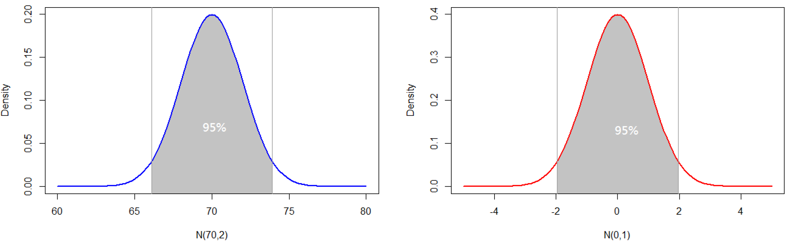
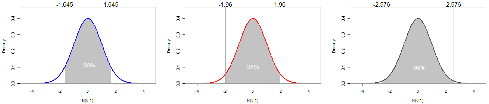
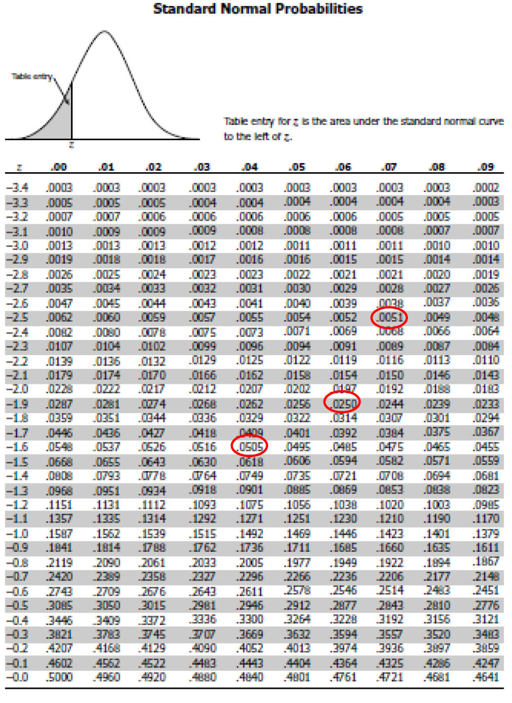

# L7. Confidence Interval

## 今天要談

* 信賴區間
* 抽樣實作
* $$t$$ 分配
* 實務應用 I & II

## 抽樣分配 

* 連鎖便利商店想要了解一般大學生午餐花費金額，抽樣調查 $$n=100$$ 名大學生的午餐花費，理論上抽樣分配如下左圖。 
* 左圖中，調查者未知的母體平均與標準差分別為 $$\mu=70$$ 元與 $$\sigma=20$$ 元，而抽樣分配之標準差為元。 
* 右圖為 $$N(0,1)$$，而平均加減 $$1.96$$個標準差約包含 $$95\%$$ 的可能性。

## 信賴區間 

* 因抽樣分配之平均為 $$\mu=70$$ 而標準差為 $$\sigma/\sqrt{n}=2$$ ，故平均加減 $$1.96$$個標準差分別為： $$70-1.96*2={\color{OrangeRed}{66.08}}$$ 與 $$70+1.96*2={\color{OrangeRed}{73.92}}$$  
* 換言之，若隨機抽 $$100$$ 次，約有 $$95$$ 次的樣本平均（記為 $$\bar{X}$$ ）會落在$$66.08$$ 至 $$73.92$$ 之間，此時，我們寫成 $$\bar{X}\in[66.08, 73.92]$$。 
* **我們定義**$$\bar{X} \pm 1.96 \times\sigma/\sqrt{n}$$ **為** $$95\%$$ **的信賴區間\(Confidence Interval\)**。 
* 當 $$\bar{X}\in[66.08, 73.92]$$ 時，計算 $$95\%$$的信賴區間（亦即 $$\bar{X}\pm1.96\times2$$ ）將會涵蓋母體平均 $$\mu=70$$。 
* 例如，當 $$\bar{X}=66.08$$ ，則 $$\bar{X}\pm1.96\times2$$ 為 $$62.16$$至$$70$$；而當 $$\bar{X}=70$$ ，則 $$\bar{X}\pm1.96\times2$$  為$$66.08$$ 至$$73.92$$ 。 兩次信賴區間皆有涵蓋 $$\mu=70$$ 。  

## 常用的信賴區間 

* 一般常用的信賴區間如下：
  * $$\bar{X}\pm {\color{OrangeRed}{1.645} }\times\sigma/\sqrt{n}$$ 為 $${\color{OrangeRed}{90\%}}$$ 的信賴區間；
  * $$\bar{X}\pm {\color{OrangeRed}{1.960} }\times\sigma/\sqrt{n}$$ 為 $${\color{OrangeRed}{95\%}}$$ 的信賴區間；
  * $$\bar{X}\pm {\color{OrangeRed}{2.576} }\times\sigma/\sqrt{n}$$ 為 $${\color{OrangeRed}{99\%}}$$ 的信賴區間。 
* 例如，隨機抽樣 $$100$$ 次，約有 $$99$$ 次的信賴區間 $$\bar{X}\pm {\color{OrangeRed}{2.576} }\times\sigma/\sqrt{n}$$ 會涵蓋母體平均$$\mu$$。


為何$$\bar{X}\pm {\color{OrangeRed}{1.645} }\times\sigma/\sqrt{n}$$ 為$${\color{OrangeRed}{90\%}}$$的信賴區間？

* 查常態分配表可知：  $$P(z<-1.645)\approx5\%$$   $$P(-1.645<z<1.645)\approx90\%$$ 或可以用R計算：`pnorm(-1.645)`
* 同理， $$\bar{X}\pm {\color{OrangeRed}{1.960} }\times\sigma/\sqrt{n}$$ 與 $$\bar{X}\pm {\color{OrangeRed}{2.576} }\times\sigma/\sqrt{n}$$ ，分別為 $$95\%$$與$$99\%$$的信賴區間。




## 抽樣數目與誤差範圍 

* 在95%的信賴區間估計中 $$\bar{X}\pm Z*\left( \frac{\sigma}{\sqrt{n}} \right)$$ 
* 我們稱 $$Z*(\sigma/\sqrt{n})$$ 為抽樣誤差\(margin of error或sampling error\)，並用來 $$e=Z*(\sigma/\sqrt{n})$$ 來代表，其中 $$Z=1.96$$。 
* 若在抽樣調查中，要求抽樣誤差必須小於某一水準，則可透過設定樣本數 $$n$$ 來達成。 
* 給定 $$e$$ 為某一數值，我們將 $$e=Z*(\sigma/\sqrt{n})$$ 加以整理，可得 $$n= ( \frac{Z*\sigma}{e} )^2$$。 

## 比例問題之信賴區間 

* 我們估計母體**平均** $${\color{OrangeRed}{\mu}}$$ 時，若抽樣數目 $$n$$ 夠多，不論母體分配為何，樣本平均值會是平均為 $${\color{OrangeRed}{\mu}}$$ 而標準差為 $$\sigma/\sqrt{n}$$ 之常態分配。 
* 當我們估計母體**比例** $${\color{OrangeRed}{p}}$$ 時，若抽樣數目 $$n$$ 夠多，樣本估計值 $$\bar{p}=X/n$$ 會呈現平均為 $${\color{OrangeRed}{p}}$$ 而標準差為 $$\sqrt{p(1-p)/n}$$ 之常態分配。  
* 因此，在比例問題中，$$95\%$$的信賴區間估計為  $$\bar{p}\pm{Z}*\sqrt\frac{{p(1-p)}}{n}$$，其中 $$Z=1.96$$  
* 同理，在比例問題中，90%與99%的信賴區間估計分別為   $$\bar{p}\pm1.645*\sqrt\frac{{p(1-p)}}{n}$$ 與 $$\bar{p}\pm2.576*\sqrt\frac{{p(1-p)}}{n}$$ 

## 比例問題之抽樣數目 

* 估計母體比例問題時，若要求抽樣誤差必須小於某一水準 $$e$$ ，則抽樣數 $$n$$ 必須至少為：   $$n=\left( {\frac{Z*\sqrt{p(1-p)}} {e}}^2 \right) = \frac{Z^2*p(1-p)}{e^2}$$  
* 然而，實際上我們就是不知道母體比例 $$p$$ ，那麼該如何去計算上述抽樣數目 $$n$$？你可以依據經驗先設定 $$p$$ 來計算需要多少 $$n$$ ；但最保守的作法是，直接將 $$p(1-p)$$ 設為最大值 $$0.5*0.5=0.25$$。 
* 例如，以 $$95\%$$ 信賴區間預估某候選人之支持比例，若要求抽樣誤差小於 $$e=2.5\%$$ ，則抽樣人數必須至少為 $$1537$$ 人。


$$n=Z^2\times p(1-p)/e^2=(1.96^2\times0.25)/(0.025^2)=1536.64$$ 


## 抽樣實作

## 調查班上同學午餐與晚餐花費 

1. 性別：男 
2. 請問你最近一次 \*午餐\* 外食費用為多少\(新台幣元\)：65 
3. 請問你最近一次晚餐外食費用為多少\(新台幣元\)：75 

| 4. 請隨機詢問班上9位同學最近一次午餐外食費用，填在下表並計算平均值\(四捨五入計算到小數點第一位\)。   | 第1位 | 第2位  | 第3位  | 第4位  | 第5位  | 第6位  | 第7位  | 第8位  | 第9位  | 平均值  |
| :--- | :--- | :--- | :--- | :--- | :--- | :--- | :--- | :--- | :--- | :--- |
| 60  | 60  | 75  | 100  | 45  | 50  | 65  | 60  | 80  | 90  | 69.4  |

與 。 \(1\)1.645\*pppn−± \(1\)2.576\*pppn−±


今天要談今天要談今天要談This page is under construction, will be ready soon! 頁面建置中，我們很快就會完成。👷 🏗 🏃 🌉 🚀


