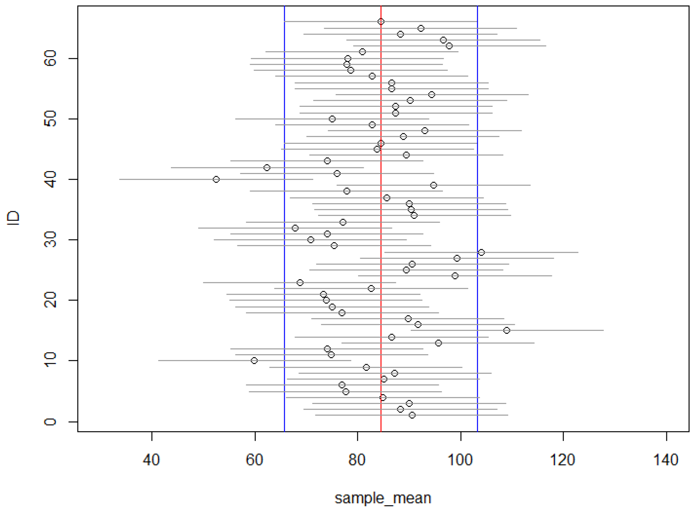
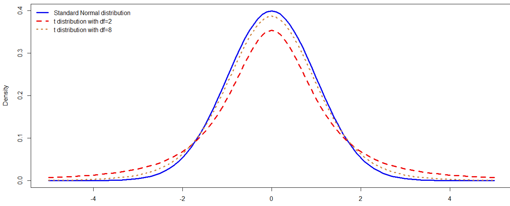
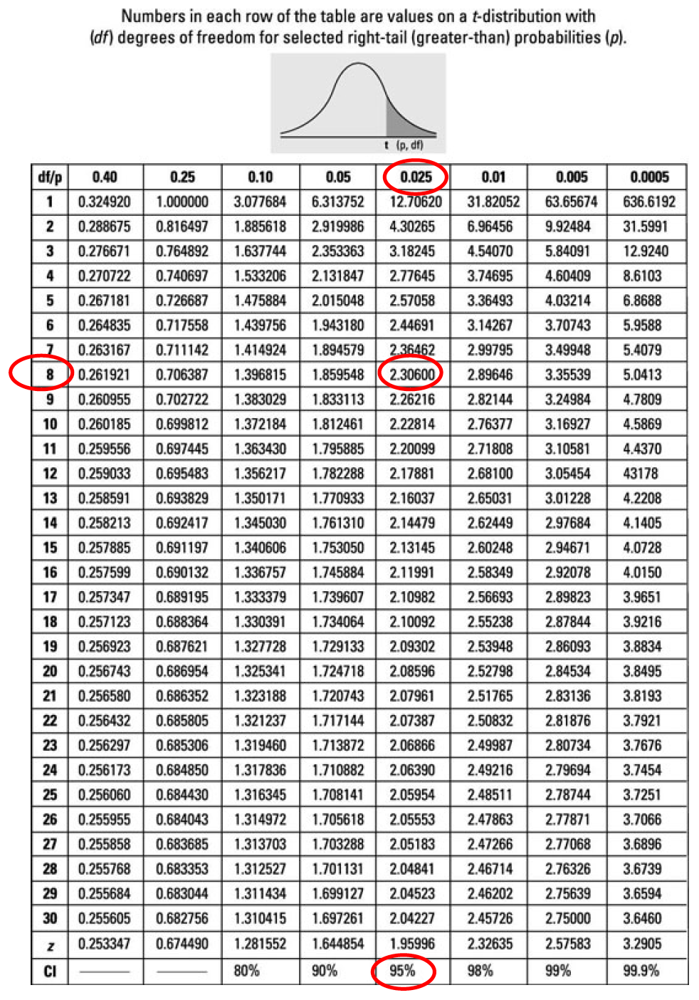
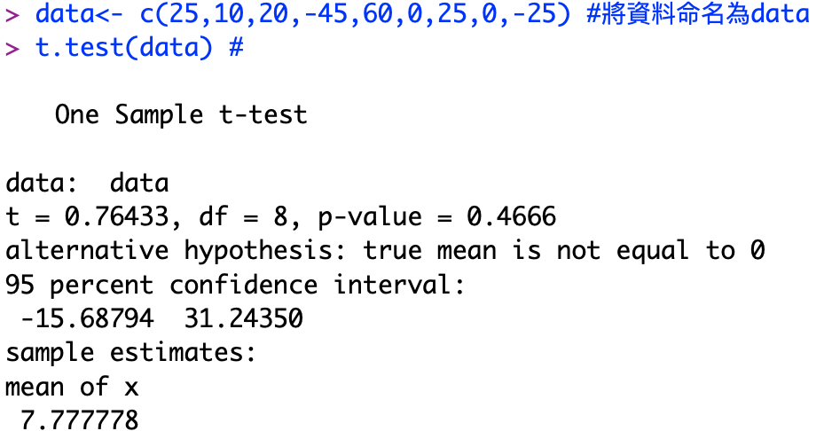
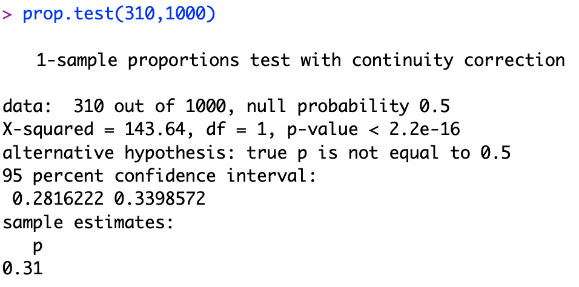

# L7. Confidence Interval

## 今天要談

* 信賴區間
* 抽樣實作
* $$t$$ 分配
* 實務應用 I & II

## 抽樣分配 

* 連鎖便利商店想要了解一般大學生午餐花費金額，抽樣調查 $$n=100$$ 名大學生的午餐花費，理論上抽樣分配如下左圖。 
* 左圖中，調查者未知的母體平均與標準差分別為 $$\mu=70$$ 元與 $$\sigma=20$$ 元，而抽樣分配之標準差為元。 
* 右圖為 $$N(0,1)$$，而平均加減 $$1.96$$個標準差約包含 $$95\%$$ 的可能性。

## 信賴區間 

* 因抽樣分配之平均為 $$\mu=70$$ 而標準差為 $$\sigma/\sqrt{n}=2$$ ，故平均加減 $$1.96$$個標準差分別為： $$70-1.96*2={\color{OrangeRed}{66.08}}$$ 與 $$70+1.96*2={\color{OrangeRed}{73.92}}$$  
* 換言之，若隨機抽 $$100$$ 次，約有 $$95$$ 次的樣本平均（記為 $$\bar{X}$$ ）會落在$$66.08$$ 至 $$73.92$$ 之間，此時，我們寫成 $$\bar{X}\in[66.08, 73.92]$$。 
* **我們定義**$$\bar{X} \pm 1.96 \times\sigma/\sqrt{n}$$ **為** $$95\%$$ **的信賴區間\(Confidence Interval\)**。 
* 當 $$\bar{X}\in[66.08, 73.92]$$ 時，計算 $$95\%$$的信賴區間（亦即 $$\bar{X}\pm1.96\times2$$ ）將會涵蓋母體平均 $$\mu=70$$。 
* 例如，當 $$\bar{X}=66.08$$ ，則 $$\bar{X}\pm1.96\times2$$ 為 $$62.16$$至$$70$$；而當 $$\bar{X}=70$$ ，則 $$\bar{X}\pm1.96\times2$$  為$$66.08$$ 至$$73.92$$ 。 兩次信賴區間皆有涵蓋 $$\mu=70$$ 。  

## 常用的信賴區間 

* 一般常用的信賴區間如下：
  * $$\bar{X}\pm {\color{OrangeRed}{1.645} }\times\sigma/\sqrt{n}$$ 為 $${\color{OrangeRed}{90\%}}$$ 的信賴區間；
  * $$\bar{X}\pm {\color{OrangeRed}{1.960} }\times\sigma/\sqrt{n}$$ 為 $${\color{OrangeRed}{95\%}}$$ 的信賴區間；
  * $$\bar{X}\pm {\color{OrangeRed}{2.576} }\times\sigma/\sqrt{n}$$ 為 $${\color{OrangeRed}{99\%}}$$ 的信賴區間。 
* 例如，隨機抽樣 $$100$$ 次，約有 $$99$$ 次的信賴區間 $$\bar{X}\pm {\color{OrangeRed}{2.576} }\times\sigma/\sqrt{n}$$ 會涵蓋母體平均$$\mu$$。


為何$$\bar{X}\pm {\color{OrangeRed}{1.645} }\times\sigma/\sqrt{n}$$ 為$${\color{OrangeRed}{90\%}}$$的信賴區間？

* 查常態分配表可知：  $$P(z<-1.645)\approx5\%$$   $$P(-1.645<z<1.645)\approx90\%$$ 或可以用R計算：`pnorm(-1.645)`
* 同理， $$\bar{X}\pm {\color{OrangeRed}{1.960} }\times\sigma/\sqrt{n}$$ 與 $$\bar{X}\pm {\color{OrangeRed}{2.576} }\times\sigma/\sqrt{n}$$ ，分別為 $$95\%$$與$$99\%$$的信賴區間。




## 抽樣數目與誤差範圍 

* 在95%的信賴區間估計中 $$\bar{X}\pm Z*\left( \frac{\sigma}{\sqrt{n}} \right)$$ 
* 我們稱 $$Z*(\sigma/\sqrt{n})$$ 為抽樣誤差\(margin of error或sampling error\)，並用來 $$e=Z*(\sigma/\sqrt{n})$$ 來代表，其中 $$Z=1.96$$。 
* 若在抽樣調查中，要求抽樣誤差必須小於某一水準，則可透過設定樣本數 $$n$$ 來達成。 
* 給定 $$e$$ 為某一數值，我們將 $$e=Z*(\sigma/\sqrt{n})$$ 加以整理，可得 $$n= ( \frac{Z*\sigma}{e} )^2$$。 

## 比例問題之信賴區間 

* 我們估計母體**平均** $${\color{OrangeRed}{\mu}}$$ 時，若抽樣數目 $$n$$ 夠多，不論母體分配為何，樣本平均值會是平均為 $${\color{OrangeRed}{\mu}}$$ 而標準差為 $$\sigma/\sqrt{n}$$ 之常態分配。 
* 當我們估計母體**比例** $${\color{OrangeRed}{p}}$$ 時，若抽樣數目 $$n$$ 夠多，樣本估計值 $$\bar{p}=X/n$$ 會呈現平均為 $${\color{OrangeRed}{p}}$$ 而標準差為 $$\sqrt{p(1-p)/n}$$ 之常態分配。  
* 因此，在比例問題中，$$95\%$$的信賴區間估計為  $$\bar{p}\pm{Z}*\sqrt\frac{{p(1-p)}}{n}$$，其中 $$Z=1.96$$  
* 同理，在比例問題中，90%與99%的信賴區間估計分別為   $$\bar{p}\pm1.645*\sqrt\frac{{p(1-p)}}{n}$$ 與 $$\bar{p}\pm2.576*\sqrt\frac{{p(1-p)}}{n}$$ 

## 比例問題之抽樣數目 

* 估計母體比例問題時，若要求抽樣誤差必須小於某一水準 $$e$$ ，則抽樣數 $$n$$ 必須至少為：   $$n=\left( {\frac{Z*\sqrt{p(1-p)}} {e}}^2 \right) = \frac{Z^2*p(1-p)}{e^2}$$  
* 然而，實際上我們就是不知道母體比例 $$p$$ ，那麼該如何去計算上述抽樣數目 $$n$$？你可以依據經驗先設定 $$p$$ 來計算需要多少 $$n$$ ；但最保守的作法是，直接將 $$p(1-p)$$ 設為最大值 $$0.5*0.5=0.25$$。 
* 例如，以 $$95\%$$ 信賴區間預估某候選人之支持比例，若要求抽樣誤差小於 $$e=2.5\%$$ ，則抽樣人數必須至少為 $$1537$$ 人。


$$n=Z^2\times p(1-p)/e^2=(1.96^2\times0.25)/(0.025^2)=1536.64$$ 


## 抽樣實作

## 調查班上同學午餐與晚餐花費 

1. 性別：男 
2. 請問你最近一次**午餐**外食費用為多少\(新台幣元\)：_65_ 
3. 請問你最近一次**晚餐**外食費用為多少\(新台幣元\)：_75_  
4. 請隨機詢問班上9位同學最近一次**午餐**外食費用，填在下表並計算平均值\(四捨五入計算到小數點第一位\)。

| 第1位  | 第2位  | 第3位  | 第4位  | 第5位  | 第6位  | 第7位  | 第8位  | 第9位  | 平均值  |
| :--- | :--- | :--- | :--- | :--- | :--- | :--- | :--- | :--- | :--- |
| _60_  | _75_  | _100_  | _45_  | _50_  | _65_  | _60_  | _80_  | _90_  | _69.4_  |

  5. 請計算全班午餐費用均值之$$95\%$$信賴區間: 


樣本平均值 $$\pm1.96\times抽樣標準差$$，亦即 $$\bar{X}\pm1.96\times ( {\sigma/\sqrt{n}})$$ 


## 計算每位同學估計的95%信賴區間 

`data<- read.csv("D://data/午晚餐費用.csv")` 

`attach(data)` 

`mu<- mean(lunch)` \#母體平均 

`sigma<- sd(lunch)` \#母體標準差 

`m<- 1.96*sigma/3` \#1.96\*抽樣標準差 

`dci<- sample_mean-m` \#信賴區間低值 

`uci<- sample_mean+m` \#信賴區間高值 

`data<- cbind(data,dci,uci)` \#將信賴區間併入資料 







## 畫出66次抽樣結果的95%信賴區間 

`plot(sample_mean,ID,xlim=c(30,140))` 

`abline(v=mu,col="red")` 

`abline(v=mu-m,col="blue")` 

`abline(v=mu+m,col="blue")` 

`segments(dci, ID, uci, ID,col="gray60")` 

## 解讀信賴區間 

* 上述例子為解說用。 
* 實務上，由於時間與成本考量，我們通常只會進行**一次抽樣**，並依據抽樣結果計算：樣本平均值 $$\pm1.96*抽樣標準差$$。
* 例如某同學依據抽樣結果，計出午餐費用之$$95\%$$信賴區間為$$75～110$$元。
* 此時，我們應解讀成，若抽樣 $$100$$ 次，每次皆計算 $$95\%$$ 信賴區間，則約有 $$95\%$$ 的信賴區間會包含真正母體平均。 
* 此次抽樣，計算出的 $$95\%$$ 信賴區間為 $$75～110$$ 元。
* 是否每次抽樣之 $$95\%$$ 信賴區間均包含母體平均？不一定，約 $${\color{OrangeRed}{5\%}}$$ 的抽樣結果之信賴區間$${\color{OrangeRed} { 會猜錯 }}$$。

## 實際應用1

## 當母體標準差未知

* 上述分析我們皆假設母體標準差 $$\sigma$$ 已知，但在實際應用時，我們並不知道 $$\sigma$$ 之值，此時，會用樣本標準差 $$s$$ 來替代 $$\sigma$$。 
* 我們定義$$t$$統計量（簡稱$$t$$值），如下： $$t = \frac{{\bar{X}-\mu}} {s/\sqrt{n}}$$  
* 其中， $$\bar{X}$$ 為樣本平均值， $$n$$ 為樣本數。 
* $$t$$ 值的分佈與樣本數 $$n$$ 相關，我們稱其是自由度\(degrees of freedom，簡稱 $$df$$ \)為 $$n-1$$ 之 $$t$$ 分配。 
* 當 $$n$$ 夠大時， $$t$$ 分配會趨近於標準常態分配 $$N(0,1)$$。 

## t分配與標準常態分佈

* 當 $$t$$ 自由度$$(n-1)$$較小時，其分配的離散程度會比標準常態分配大；而當自由度越大時， $$t$$ 分配會趨近標準常態分配。

## 用R求算t值或查表

用R來查t值之指令如下: 

`qt(0.025,df=8)` \#求出當 $$\text{df}=8$$而 $$P(X \leq t)$$為 $$2.5\%$$之 $$t$$ 值為何 ≤

例如: 

`qt(0.025,df=8)` 

\#\[1\] -2.306004 

\#因分佈對稱性可得 $${\color{OrangeRed}P(X\geq 2.306004) = 0.025}$$

`qt(0.050,df=8)` 

\#\[1\] -1.859548 

`qt(0.01,df=30)` 

\#\[1\] -2.457262 

## 同學午晚餐的花費是否有差異 

* 隨機詢問班上9位同學最近一次晚餐\(dinner\)與午餐\(lunch\)外食費用，計算 $${\color {OrangeRed}{d = \text{dinner - lunch}}}$$如下表: 
* | 第1位  | 第2位  | 第3位  | 第4位  | 第5位  | 第6位  | 第7位  | 第8位  | 第9位  | 平均值  |
  | :--- | :--- | :--- | :--- | :--- | :--- | :--- | :--- | :--- | :--- |
  | 25  | 10  | 20  | -45  | 60  | 0  | 25  | 0  | -25  | 7.77  |

  $${\color{OrangeRed}d}$$ 之 $$95\%$$ 信賴區間：

  * 平均值$$\pm自由度$$ 為 $$(n-1=8)$$之 $$t$$值\*抽樣標準差，亦即 $$\bar{d}\pm2.306004* \left({s/\sqrt{n}} \right) \Rightarrow 95\%$$ 之CI為 $$-15.68794～31.24350$$。
  * 其中， $$\bar{d}=7.77, s=30.52777$$為樣本標準差，而 $$n=9$$ 為抽樣數。

## 計算不同信心水準\(confidence level\)的信賴區間

* 我們查表得知，在 $$90\%$$ 與 $$99\%$$ 信心水準下，自由度為 $$(n-1=8)$$ 之 $$t$$ 值分別為 $$t=1.859548$$ 與 $$t=2.896459$$。
* 將 $$90\%$$ 與 $$99\%$$ 信心水準下之 $$t$$ 值帶入 $$\bar{d}\pm t*(\frac{s}{\sqrt{n}})$$，可得到 ：
  * $$90\%$$之CI： $$-11.14484～26.70039$$
  * $$99\%$$ 之CI： $$-26.36638～41.92194$$ 
* 例如，$$90\%$$之CI算法為：  $$\bar{d}\pm t*(\frac{s}{\sqrt{n}})=7.77\pm1.859548*(30.52777/\sqrt{9})$$ 

## 用R 計算信賴區間

`data<- c(25,10,20,-45,60,0,25,0,-25)` \#將資料命名為data 

`t.test(data)` \#進行雙尾檢定並計算信賴區間, 結果如下圖及說明： 


解讀R的結果: 

* $$t=0.76433$$ 就是 $$t$$ 統計量，$$\text{df}=8$$ 為自由度。 
* $${\color{OrangeRed}{-15.68794～31.24350}}$$ 為 $${\color{OrangeRed}{95\%}}$$ 之信賴區間。 
* $$p\text{-}value = 0.4666$$ 表示在自由度為 $$8$$ 的 $$t$$ 分配下， $$t > 0.76433$$ 或 $$t < -0.76433$$ 的可能性為0.4666 ；如何解讀此結果？之後的Lecture會講解，在此先略過。 


## R計算不同信心水準\(confidence level\)的信賴區間 

`ci90<-t.test(data,conf.level = 0.90)` \#計算 $$90\%$$ 信賴區間並命名為ci90 

`ci95<-t.test(data,conf.level = 0.95)` \#計算 $$95\%$$ 信賴區間並命名為ci95 

`ci99<-t.test(data,conf.level = 0.99)` \#計算 $$90\%$$ 信賴區間並命名為ci99 

`rbind(ci90$conf.int, ci95$conf.int, ci99$conf.int)` 

\#將信賴區間的估計結果依序帶出並加以合併，$conf.int代表只呼叫信賴區間之估計結果 

* 估計結果如下，可看出 $$90\%$$ 信賴區間的估計範圍最窄，Why? 

 $${\color{OrangeRed}{90\%}}$$ 之CI: $${\color{ORangeRed}{-11.14484～26.70039 }}$$ 

 $$95\%$$ 之CI: $$-15.68794～31.24350$$ 

 $$99\%$$ 之CI: $$ -26.36638～41.92194 $$ 

## 實際應用2 

## 估計母體比例 

* 電信業者抽樣推估全國大學生使用 Apple 手機之比例。 
* 在某次抽樣調查中，抽樣人數為 $$n=1000$$ ，使用Apple手機的學生人數為 $$X=310$$ ， 故對於母體 $$p$$ 的估計為 $$\bar{p}=X/n=310/1000=0.31$$。 
* 95%的信賴區間估計為 $$\bar{p}\pm Z*\sqrt\frac{\bar{p}(1-\bar{p})}{n}=0.31\pm1.96*\sqrt\frac{0.31*(1-0.31)}{1000}$$，答案為 $$0.2813344～0.3386656$$ 。 換言之，約 $$28.1\%～33.8\%$$。 
* 同理，將 $$z=1.645$$ 與 $$z=2.576$$ 帶入上式，可得 $$90\%$$ 與 $$95\%$$ 的信賴區間估計。 

## 用R估計比例問題 

`prop.test(310,1000)` 

\# $$1000$$ 個樣本中有 $$310$$ 人買Apple，計算 $$95\%$$ 信賴區間，結果如下圖： 


解讀R的結果: 

* 如何解讀：   $$X\text{-}squared=143.64, \text{df}=1, p\text{-}value\text{ < } 2.2\text{e-}16$$   之後的Lecture會講解，在此先略過。  
* $${\color{OrangeRed}{0.2816222～0.3398572}}$$ 為 $${\color{OrangeRed}{95\%}}$$ 之信賴區間。 此與上頁估計\(使用常態分配\)有些微差異，是因為R使用二項分配估計，而結果更為精確。 


## 複習一下 

* 何謂信賴區間？ 
* 有哪些方法可讓信賴區間較小？ 
* 母體標準差未知時如何估計信賴區間？ 
* 母體比例未知時如何估計比例問題之信賴區間？


### 作業1 

* 在某次選舉民調中，新聞報導最後寫道：「這些調查都在九月廿一日至廿五日晚間進行，成功訪問了一千零七十位設籍桃園市的成年民眾，…。 在百分之九十五的信心水準下，抽樣誤差均在正負三點零個百分點以內。」  
* 請估算此次調查的抽樣誤差是否在 $$3\%$$ 以內？ 

資料來源: [https://udn.com/news/story/11311/3389290](https://udn.com/news/story/11311/3389290)



### 作業2 

* 請第 $$i$$ 組同學隨機抽樣 $$i+100$$ 人，估計本校學生之性別比例並計算 $$95\%$$ 信賴區間。 
* 答案需紀錄抽樣調查的時間與地點。 


